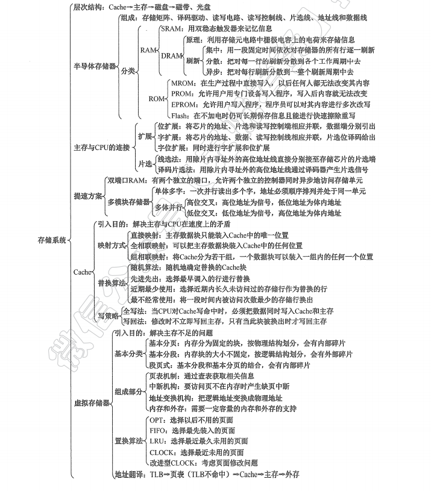

### 存储器

存储数据(与CPU通信，与主存通信)->容量（多个相连），成本(外存储器，内存储器)，速度（ROM,RAM）->存储器分级->主存，cache，寄存器 –>虚拟存储器

#### 存储器的分类

#### 存储器的性能指标

存储容量，成本，速度

#### 多级存储系统

寄存器，cache，主存，硬盘，光盘

#### 半导体存储器

DRAM,SRAM，易失性存储器

##### SRAM：双稳态触发器，非破坏性读出

##### DRAM：栅极电容上的电荷存储信息，DRAM采用地址复用技术，地址线是原来的1/2，且地址信号分行、列两次传送。电荷需要每2ms刷新一下，

集中刷新

分散刷新

异步刷新

##### **RAM读写周期**

#### 主存储器与CPU的连接

单块存储器与CPU的连接：数据总线，地址总线，控制总线

片选线CS：（高电平有效）

读写控制线WE:

主存容量的扩展：

**位扩展**：增加存储字长（每次传输多个字长的数据）

**字扩展**：（线选法，译码片选法）

**字位同时扩展**：

线选法：

译码片选法：

#### 双端口RAM和多模块存储器

双端口RAM:

多模块存储器：

单体多字：

多体并行：
多体并行存储器分为**高位交叉编址**（顺序方式）和**低位交叉编址**（交叉方式)两种。
       高位交叉编址: 高位地址表示体号，低位地址为体内地址。

低位交叉编址: 高位地址表示体内地址，低位地址为体号。

**（如何根据给定信息计算地址）**

#### 高速缓冲存储器

局部性原理：

cache（缓存）：

与主存的映射方式：直接映射，全相联，组相联，

在采用全相联映射或组相联映射方式时，从主存向Cache传送一个新块，当Cache或Cache组中的空间已被占满时，就需要使用替换算法置换Cache行。替换算法：随机算法，先进先出，最近最少使用算法

当内容更新，需要使用**cache写策略**：全写法，写回法

##### 虚拟存储器

