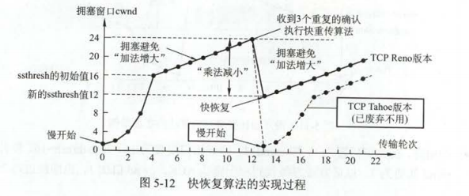

## TCP协议相关

1.   TCP所在的层次为传输层，提供端到端的通信，也就是进程之间的通信
2.   对报文进行差错检测，拥塞控制

### 1. 三次握手四次挥手

##### TCP协议如何保证可靠行

**（1）**采用三次握手四次挥手保证建立的**传输信道是可靠的**。

**（2）**采用了序号，确认，超时和冗余ACK协议**数据传输的可靠性**。

**（3）**采用**滑动窗口**协议进行流量控制

**（4）**使用**慢开始**、**拥塞避免**、**快重传**和**快恢复**来进行**拥塞控制**

##### TCP三次握手流程,为什么需要三次，四次或者两次有什么问题

全面总结：https://blog.csdn.net/qq_38950316/article/details/81087809

**三次握手流程：**

同步位SYN。SYN=1表示这是一个连接请求或连接接收报文。
	  当SYN= 1，ACK=0: 连接请求报文，对方若同意建立连接，则在响应报文中使用SYN =1，ACK=1。即SYN= 1表示这是一个连接请求或连接接收报文。

> 1. 第一步:客户机的TCP首先向服务器的TCP发送一个连接请求报文段。这个特殊的报文段中不含应用层数据，其首部中的SYN标志位被置为1。另外，客户机会随机选择一个起始序号seq =x(连接请求报文不携带数据，但要消耗一个序号)。
>
> 2. 第二步:服务器的TCP收到连接请求报文段后，如同意建立连接，就向客户机发回确认，并为该TCP连接分配TCP缓存和变量。在确认报文段中，SYN和ACK位都被置为1，确认号字段的值为x+1,并且服务器随机产生起始序号seq=y(确认报文不携带数据,但也要消耗一个序号)。确认报文段同样不包含应用层数据。
>
> 3. 第三步:当客户机收到确认报文段后，还要向服务器给出确认，并且也要给该连接分配缓存和变量。这个报文段的ACK标志位被置1，序号字段为x+1，确认号字段ack =y+1。该报文段可以携带数据，若不携带数据则不消耗序号。
>
>     >   TCP泛洪攻击：通过不断的发送连接请求，然后服务器给与回应，客户端不再理睬，不能等待到最后一个ACK包，导致一直触发超时重传，当服务器端口占用完后就无法为正常连接请求提供服务。
>     >
>     >   如何解决：限制单IP并发数,修改重试次数,限制单位时间内连接数，Syn Cache技术（**收到SYN数据报文时不急于去分配TCB，而是先回应一个SYN ACK报文，并在一个专用HASH表（Cache）中保存这种半开连接信息，直到收到正确的回应ACK报文再分配TCB**）Syn Cookie技术（SYN Cookie是对TCP服务器端的三次握手做一些修改，专门用来防范SYN Flood攻击的一种手段。它的原理是，在TCP服务器接收到TCP SYN包并返回TCP SYN + ACK包时，不分配一个专门的数据区，而是根据这个SYN包计算出一个cookie值。这个cookie作为将要返回的SYN ACK包的初始序列号。当客户端返回一个ACK包时，根据包头信息计算cookie，与返回的确认序列号(初始序列号 + 1)进行对比，如果相同，则是一个正常连接，然后，分配资源，建立连接。
>     >

> ###### 为什么不采用两次握手；
>
> 这主要是为了防止两次握手情况下已失效的连接请求报文段突然乂传送到服务器而产生销误。考虑下面这种情况。客户A向服务器B发出TCP连接请求，第一个连接请求报文在网络的某个结点长时间滞留，A超时后认为报文丢失，于是再重传一次连接请求，B收到后建立连接。数据传输完毕后双方断开连接。而此时，前一个滞留在网络中的连接请求到达服务器B，而B认为A又发来连接请求，此时若使用“三次握手”，则B收到A迟到的确认报文z，HTTP一为步输连请求，因此A不予理睬，建立连接失败。若采用的是“两次握手”，则这种情况下B认为传输连接已经建立，并一直等待A传输数据，而A此时并无连接请求，因此不予理睬，这样就造成了B的资源白白浪费。

##### TCP四次挥手过程

> 1. 第一步:客户机打算关闭连接时，向其TCP发送一个连接释放报文段，并停止发送数据，主动关闭TCP连接，该报文段的FIN标志位被置1，seq=u，它等于前面已传送过的数据的最后一个字节的序号加1(FIN 报文段即使不携带数据，也要消耗一个序号)。TCP是全双工的，即可以想象为一条TCP连接上有两条数据通路。发送FIN报文时，发送FIN的一端不能再发送数据，即关闭了其中一条数据通路，但对方还可以发送数据。
> 2. 第二步:服务器收到连接释放报文段后即发出确认，确认号是ack =u+1，而这个报文段自己的序号是v，等于它前面已传送过的数据的最后一个字节的序号加1。此时，从客户机到服务器这个方向的连接就释放了，TCP连接处于半关闭状态。但服务器若发送数据，客户机仍要接收，即从服务器到客户机这个方向的连接并未关闭。
> 3. 第三步:若服务器已经没有要向客户机发送的数据，就通知TCP释放连接，此时其发出FIN=1的连接释放报文段。
> 4. 第四步:客户机收到连接释放报文段后，必须发出确认。在确认报文段中，ACK字段被置为1，确认号ack = w +1，序号seq=u+1。此时TCP连接还未释放，必须经过时间等待计时器设置的时间2MSL后，A才进入连接关闭状态。
>
> ###### 为何不采用“三次挥手”释放连接，且发送最后一次握手报文后要等待2MSL的时间呢?
>
> 1）保证A发送的最后一个确认报文段能够到达B。如果A不等待2MSL，若A返回的最后确认报文段丢失，则B不能进入正常关闭状态，而A此时已经关闭，也不可能再重傳
>     2）防止出现“已失效的连接请求报文段”。A在发送最后一个确认报文段后，再经过2MSL可保证本连接持续的时间内所产生的所有报文段从网络中消失。

##### **TCP流量控制，拥塞控制**

###### TCP流量控制

> 基于滑动窗口

###### 拥塞控制

> ###### 慢开始：
>
> 在TCP协议刚连接好时，由于网络情况不明朗，所以先令拥塞窗口Cwnd=l，即一个最大报文段长度MSS。而在每收到一个对新的报文段的确认后，将cwnd加1，即增大一个MSS。用这样的方法逐步增大发送方的拥塞窗口cwnd，可以使分组注入到网络的速率更加合理。使用慢开始算法后，**每经过一个传输轮次(即往返时延RTT)，拥塞窗口cwnd就会加倍**，即**cwnd 的大小呈指数形式增长**。这样慢开始一直把拥塞窗口 cwnd 增大到一个规定的**慢开始门限ssthresh(阙值)**，然后改用拥塞避免算法。
>
> ###### 拥塞控制
>
> 拥塞避免算法的做法是:发送端的拥塞窗口cwnd每经过一个往返时延RTT 就**增加一个MSS的大小**，而不是加倍，使cwnd按线性规律缓慢增长（即加法增大)，而当出现一次超时(网络拥塞）时，则令**慢开始门限ssthresh等于当前cwnd 的一半（即乘法减小)**。
> 				根据cwnd 的大小执行不同的算法，可归纳如下:
> 						当cwnd<ssthresh时,使用慢开始算法。
> 						当cwnd>ssthresh 时，停止使用慢开始算法而改用拥塞避免算法。
> 						当cwnd=ssthresh 时，既可使用慢开始算法，也可使用拥塞避免算法（通常做法)。
>
> 只要出现“没有按时收到确认，重传计时器超时”就把cwnd=1，慢开始门限减为一半，这样做的目的就是**迅速减少网络中的分组数**，
>
> ###### 快重传
>
> 当发送方连续收到三个重复的ACK报文时，直接重传对方尚未收到的报文段，而不必等待那个报文段设置的重传计时器超时。
>
> ###### 快恢复
>
> 当发送端收到连续**三个冗余ACK(即重复确认）时**，就执行“**乘法减小**”算法，把慢开始门限 ssthresh 设置为出现拥塞时发送方cwnd的一半。与慢开始（慢开始算法将拥塞窗口 cwnd 设置为1)不同之处是**它把cwnd 的值设置为慢开始门限ssthresh 改变后的数值**，然后开始执行拥塞避免算法(“**加法增大**”)，使拥塞窗口缓慢地线性增大。
>
> 
>
> ###### MSS設置的太大或者太小怎麽辦？
>
> 答:MSS 与接收窗口没有关系。TCP的报文段的数据部分，至少要加上40字节的首部（TCP首部至少20字节和IP首部至少20字节)，才能组装成一个IP数据报。若选择较小的MSS值，网络的利用率就很低。极端情况下，当TCP报文段中只含有1字节的数据时，在IP层传输的数据报的开销至少有40字节。这样，网络的利用率就不会超过1/41。到了数据链路层还要加上一些开销，网络的利用率进一步降低。
>
> 但反过来，若TCP报文段很长，那么在IP层传输时有可能要分解成多个短数据报片，在终端还要把收到的各数据报片装配成原来的TCP报文段。当传输有差错时，还要进行重传。这些都会使开销增大。
> 因此，**MSS应尽量大些，只要在IP层传输时不要再分片就行**。由于IP数据报所经历的路径是动态变化的，在一条路径上确定的不需要分片的MSS，如果改走另一条路径就可能需要进行分片。因此，最佳的MSS是很难确定的。MSS 的默认值为536字节，因此在因特网上的所有主机都能接收的报文段长度是536+20(TCP固定首部长度）=556字节。

##### TCP和UDP的区别

**TCP:**面向连接，一对一，面向字节流，可靠传输，首部开销大（最大60字节）

**UDP：**无连接，不可靠，面向报文，首部开销小（8字节），传输效率高

**面向报文：**应用层交给UDP多长的报文，UDP就照样发送，即一次发送一个报文。

**面向字节流**，虽然应用程序和TCP的交互是一次一个数据块（大小不等），但TCP把应用程序看成是一连串的无结构的字节流。TCP有一个缓冲，当应用程序传送的数据块太长，TCP就可以把它划分短一些再传送。如果应用程序一次只发送一个字节，TCP也可以等待积累有足够多的字节后再构成报文段发送出去

##### TCP分片重组

如上图所示：

*   MTU：一个网络包的最大长度，以太网中一般为 1500 字节；
*   MSS：除去 IP 和 TCP 头部之后，一个网络包所能容纳的 TCP 数据的最大长度；

虽然在IP层也会有分片重组功能，但是IP 层本身没有超时重传机制，它由传输层的 TCP 来负责超时和重传，当接收方发现 TCP 报文（头部 + 数据）的某一片丢失后，则不会响应 ACK 给对方，那么发送方的 TCP 在超时后，**就会重发「整个 TCP 报文（头部 + 数据）」。**

所以我们尽量不要利用IP分片的功能，在TCP层进行分片。所以在**建立连接的时候通常要协商双方的 MSS 值**，当 TCP 层发现数据超过 MSS 时，则就先会进行分片，当然由它形成的 IP 包的长度也就不会大于 MTU ，自然也就不用 IP 分片了，这样**经过 TCP 层分片后，如果一个 TCP 分片丢失后，进行重发时也是以 MSS 为单位，而不用重传所有的分片，大大增加了重传的效率**

### 2.如何设计一个既有UDP的效率，又要有TCP的可靠性的协议

一个网络协议的设计目标主要有三个: 实时性、可靠性、公平性, TCP的设计目标主要是可靠性和公平性， KCP 在 UDP 的基础上, 实现了用户态的确认、ARQ、流量控制与拥塞控制, 它的设计目标是实时性与可靠性, 一定程度上破坏了公平性。

#### 保证可靠传输

1.  保证交付给上层的数据是完整的, 即不丢失, 因此需要设置确认机制
2.  保证交付给上层的数据是有序的
3.  控制向应用层交付数据的速率, 避免应用层来不及消费数据而丢包
4.  需要有拥塞控制机制, 当网络拥挤时, 进行拥塞控制

可靠传输的 UDP 协议同样需要有报文序号、确认、自动重传、滑动窗口、拥塞控制等特性。

##### 自动重传

对于可靠传输协议, 当发送方向接收方发送报文以后, 必须需要等待接收方发回的确认才能保证这个数据包已经到达了接收方, 为此发送方需要设置发送缓存用于暂存已经发送但未收到确认的数据包, 当接收到另一方的确认报文后才能将数据包从发送缓存中移除, 对于每一个数据包, 发送方需要设置一个超时计时器, 当超过指定时间未收到对方的确认后, 需要重传这个数据包，为了提高通信效率, 发送方不必等待上一个报文被确认后再发送下一个报文, 而是可以**采用流水线**的方式连续发送多个数据包, 当然可以连续发送的数据包的数量是有限制的, 它受**对方的接收窗口以及当前的拥塞窗口控制**

超时时间：

### 3.TCP粘包拆包

##### 1.为什么有粘包

由于UDP是面向报文的，应用层交给UDP多长的报文，UDP就照样发送，即一次发送一个报文。所以UDP是有边界的。而TCP是面向字节流的，没有边界，而操作系统在发送TCP数据时，会通过缓冲区来进行优化，例如缓冲区为1024个字节大小。如果一次请求发送的数据量比较小，没达到缓冲区大小，<u>TCP则会将多个请求合并为同一个请求进行发送，这就形成了粘包问题</u>。

**粘包：**两个包长度比较小，没有达到一次发送的量，所以两个包合成一个进行发送

**拆包：**一个包过大，超过缓存区大小，拆分成两个或多个包发送;

**拆包和粘包**：Packet1过大，进行了拆包处理，而拆出去的一部分又与Packet2进行粘包处理。

##### 常见的解决方案：

1. 发送端将每个包都封装成固定的长度，比如100字节大小。如果不足100字节可通过补0或空等进行填充到指定长度;

2. 发送端在每个包的末尾使用固定的分隔符，例如\r\n。如果发生拆包需等待多个包发送过来之后再找到其中的\r\n进行合并;例如，FTP协议;

3. 将消息分为头部和消息体，头部中保存整个消息的长度，只有读取到足够长度的消息之后才算是读到了一个完整的消息;

4. 通过自定义协议进行粘包和拆包的处理。

##### Netty对粘拆包问题的解决

Netty对解决粘包和拆包的方案做了抽象，提供了一些解码器(Decoder)来解决粘包和拆包的问题。如：

- LineBasedFrameDecoder：以行为单位进行数据包的解码;
- DelimiterBasedFrameDecoder：以特殊的符号作为分隔来进行数据包的解码;
- FixedLengthFrameDecoder：以固定长度进行数据包的解码;
- LenghtFieldBasedFrameDecode：适用于消息头包含消息长度的协议(最常用);

