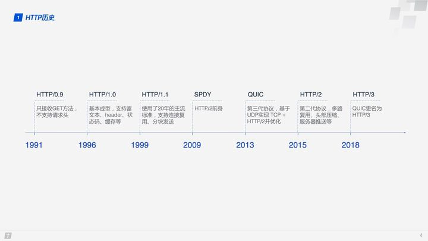

HTTP1.1
-------

##### HTTP1.0、HTTP1.1 和 HTTP2.0 的区别

1996年HTTP1.0，1999年HTTP1.1，2015年HTTP2.0

###### HTTP1.0和HTTP1.0的不同

> 1. 缓存处理（引入了更多的缓存控制策略例如Entity tag，If-Unmodified-Since, If-Match, If-None-Match等更多可供选择的缓存头来控制缓存策略）
>
> 2. 带宽优化及网络连接的使用：浪费带宽，不支持断点续传
> 3. **错误通知的管理**（新增了24个错误状态响应码，如409（Conflict）表示请求的资源与资源的当前状态发生冲突；410（Gone）表示服务器上的某个资源被永久性的删除）
> 4. **Host头处理**
> 5. **长连接**：在一个TCP连接上可以传送多个HTTP请求和响应，减少了建立和关闭连接的消耗和延迟，在HTTP1.1中默认开启Connection： keep-alive


##### 五大类状态码

|      |                                                           |      |
| ---- | --------------------------------------------------------- | ---- |
| 1XX  | 提示信息，表示目前是协议处理的中间状态，还需要后续的操作; |      |
| 2XX  | 成功，报文已经收到并被正确处理;                           |      |
| 3XX  | 重定向，资源位置发生变动，需要客户端重新发送请求;         |      |
| 4XX  | 客户端错误，请求报文有误，服务器无法处理;                 |      |
| 5XX  | 服务器错误，服务器在处理请求时内部发生了错误。            |      |

​	<u>1XX类 </u>状态码属于提示信息，是协议处理中的一种中间状态，实际用到的比较少。
​			<u><u>2xx类 状态码表示服务器成功处理了客户端的请求，也是我们最愿意看到的状态。</u>

				1. 200 OK 是最常见的成功状态码，表示一切正常。如果是非HEAD请求，服务器返回的响应头都会有 body数据。
				2. 204 No Content 也是常见的成功状态码，与200 OK基本相同，但响应头没有body数据。
				3. 206 Partial Content」是应用于HTTP分块下载或断点续传，表示响应返回的 body数据并不是资源的全部，而是其中的一部分，也是服务器处理成功的状态。

​	<u>	3xx类 状态码表示客户端请求的资源发送了变动，需要客户端用新的URL重新发送请求获取资源，也就是重定向。</u>

   1.    301 Moved Permanently」表示永久重定向，说明请求的资源已经不存在了，需改用新的URL再次访问。

   2.    302 Found表示临时重定向，说明请求的资源还在，但暂时需要用另一个URL来访问。

   3.    304 Not Modified」不具有跳转的含义，表示资源未修改，重定向已存在的缓冲文件，也称缓存重定向，用于存控制。

   4. 307  临时重定向 可以确保请求方法和消息主体不会发生变化，不会将Post换为Get,**而对于GET 请求来说，两种情况没有区别**

   5. <u>4xx类状态码表示客户端发送的报文有误，服务器无法处理，也就是错误码的含义。</u>

   6. 400 Bad Request」表示客户端请求的报文有错误，但只是个笼统的错误。

   7. 403 Forbidden」表示服务器禁止访问资源，并不是客户端的请求出错。

   8. 404 Not Found」表示请求的资源在服务器上不存在或未找到，所以无法提供给客户端

   9. 5xx类状态码表示客户端请求报文正确，但是服务器处理时内部发生了错误，属于服务器端的错误码。

      ```
      		1. 500 Internal Server Error与400类型，是个笼统通用的错误码，服务器发生了什么错误，我们并不知道。
      		2. 501 Not lmplemented 表示客户端请求的功能还不支持，类似“即将开业，敬请期待”的意思。
      		3. 502 Bad Gateway通常是服务器作为网关或代理时返回的错误码，表示服务器自身工作正常，访问后端服务器发生了错误。
      		4. 503 Service Unavailable表示服务器当前很忙，暂时无法响应服务器，类似“网络服务正忙，请稍后重试”的意思。
      ```

## HTTP2原理

HTTPS在安全上已经做得足够好了，所以HTTP2就需要进一步在性能上进行提升。

### HTTP1.1和HTTP2.0的不同

> 1. 新的二进制格式(基于文本->基于二进制)
>
>     >   ASCII 码报文改为二进制格式，解析起来没有歧义，实现简单，而且体积小、速度快，
>
> 2. 多路复用–多个往返通信都复用一个连接来处理。
>
>     >   所有的相同域名请求都通过同一个TCP连接并发完成。在HTTP1.x中，并发多个请求需要多个TCP连接，浏览器为了控制资源会有6-8个TCP连接都限制。
>     >
>     >   在 HTTP/1 中，每次请求都会建立一次HTTP连接，也就是我们常说的3次握手4次挥手，这个过程在一次请求过程中占用了相当长的时间，即使开启了 Keep-Alive ，解决了多次连接的问题，但是依然有两个效率上的问题：
>     >
>     >   *   第一个：串行的文件传输。当请求a文件时，b文件只能等待，等待a连接到服务器、服务器处理文件、服务器返回文件，这三个步骤。我们假设这三步用时都是1秒，那么a文件用时为3秒，b文件传输完成用时为6秒，依此类推。（注：此项计算有一个前提条件，就是浏览器和服务器是单通道传输）
>     >   *   第二个：连接数过多。我们假设Apache设置了最大并发数为300，因为浏览器限制，浏览器发起的最大请求数为6，也就是服务器能承载的最高并发为50，当第51个人访问时，就需要等待前面某个请求处理完成。
>     >
>     >   HTTP/2的多路复用就是为了解决上述的两个性能问题。在 HTTP/2 中，有两个非常重要的概念，分别是帧（frame）和流（stream）。
>     >   帧代表着最小的数据单位，每个帧会标识出该帧属于哪个流，流也就是多个帧组成的数据流。
>     >   多路复用，就是在一个 TCP 连接中可以存在多条流。换句话说，也就是可以发送多个请求，对端可以通过帧中的标识知道属于哪个请求。通过这个技术，可以避免 HTTP 旧版本中的队头阻塞问题，极大的提高传输性能。
>
> 3. 头部数据压缩
>
>     >   在1.1中头部可以指定请求体的编码方式。gzip等，但是header没有被压缩，发了专门的“**HPACK**”算法，在客户端和服务器两端建立“字典”，用索引号表示重复的字符串，还釆用哈夫曼编码来压缩整数和字符串，可以达到 50%~90% 的高压缩率
>
> 4. 服务器推送（有些文件捆绑在一起，请求其中的一个可以将剩下的推送给客户端）
>
>     >   HTTP/2 改变了传统的“请求 - 应答”工作模式，服务器不再是完全被动地响应请求，也可以新建“流”主动向客户端发送消息。比如，在浏览器刚请求 HTML 的时候就提前把可能会用到的 JS、CSS 文件发给客户端，减少等待的延迟
>
> 5. 强化安全
>
>     >   HTTP/2 是加密的，跑在 TLS 上面，要求下层的通信协议**必须是 TLS1.2 以上，还要支持前向安全和 SNI**，并且把几百个弱密码套件列入了“黑名单”

### HTTP2实现

##### 连接前言

收发数据之前，会有 TCP 握手和 TLS 握手阶段，TLS 握手成功之后，客户端必须要发送一个“**连接前言**”，用来确认建立 HTTP/2 连接。只要服务器收到这个“有魔力的字符串”，就知道客户端在 TLS 上想要的是 HTTP/2 协议

##### 头部压缩

原始Header+Body采用ASCII码。HTTP2还是采用Header+Body形式，并采用**HPACK**压缩头部数据。压缩分为静态表和动态表两种方式，

静态表：


如果是自定义字段，那就需要**动态表**：它添加在静态表后面，结构相同，但会在编码解码的时候随时更新。第一次发送请求时的“user-agent”字段长是一百多个字节，用哈夫曼压缩编码发送之后，客户端和服务器都更新自己的动态表，添加一个新的索引号“65”。那么下一次发送的时候就不用再重复发那么多字节了，只要用一个字节发送编号就好。这样就大大提高了压缩效率

##### 二进制帧

HTTP/2 的报头只有 9 字节


**帧长度：**3字节，HTTP/2 的帧通常不超过 16K，最大是 16M

帧类型：1字节，分成**数据帧**和**控制帧**两类，HEADERS 帧和 DATA 帧属于数据帧，存放的是 HTTP 报文，而 SETTINGS、PING、PRIORITY 等则是用来管理流的控制帧。HTTP/2 总共定义了 10 种类型的帧，但一个字节可以表示最多 256 ，可以留下来进行扩展，Google 的 gRPC 定义了几种自用的新帧类型。

**帧标志**信息：携带简单的控制信息，常用的标志位有**END_HEADERS**表示头数据结束，**END_STREAM**表示单方向数据发送结束。

**流标识符**：接收方使用它就可以从乱序的帧里识别出具有相同流 ID 的帧序列，流标识符的上限是 2^31，大约是 21 亿。

##### 流与多路复用

HTTP/2 在一个连接上使用多个流收发数据，那么它本身默认就会是长连接，所以永远不需要“Connection”头字段（keepalive 或 close）

下载大文件的时候想取消接收，在 HTTP/1 里只能断开 TCP 连接重新“三次握手”，成本很高，而在 HTTP/2 里就可以简单地发送一个“RST_STREAM”中断流，而长连接会继续保持。

##### 流状态转换

HTTP/2 借鉴了 TCP，根据帧的标志位实现流状态转换，最开始都是“**空闲**”（idle）状态，客户端发送 HEADERS 帧后，有了流 ID，流就进入了“**打开**”状态，两端都可以收发数据，然后客户端发送一个带“END_STREAM”标志位的帧，流就进入了“**半关闭**”状态。响应数据发完了之后，也要带上“END_STREAM”标志位，表示数据发送完毕，这样流两端就都进入了“**关闭**”状态，流就结束了。

流ID不能重用，再一次TCP多个传输请求中依次递增，直到到达上限，发送“GOAWAY”帧开一个新的 TCP 连接，流 ID 就又可以重头计数

## HTTP/3原理

>   零 RTT 建立连接, 连接迁移,服务发现

https://www.zhihu.com/org/teng-xun-ji-zhu-gong-cheng/posts/posts_by_votes?page=2

在介绍 HTTP/3 之前，我们先简单看下 HTTP 的历史，了解下 HTTP/3 出现的背景。



2013年Google开发了基于UDP的名为 QUIC 的传输层协议，全称 Quick UDP Internet Connections，希望它能替代 TCP，使得网页传输更加高效。后来互联网工程任务组正式将基于 QUIC 协议的 HTTP （HTTP over QUIC）重命名为 HTTP/3。

所以HTTP/2体系为IP+TCP+TLS是HTTP/2目前常用的体系，而HTTP3 体系为IP+UDP+QUIC，运行在 QUIC 之上的 HTTP 协议被称为 HTTP/3，这就是”HTTP over QUIC 即 HTTP/3“的含义。HTTP3解决了HTTP2“**队头阻塞**”的问题


##### **1.零 RTT 建立连接**

首次连接1RTT,非首次连接0RTT

HTTP/2建立连接需要 3 RTT，即使TLS 升级到 1.3，那么 HTTP/2 连接需要 2 RTT（两趟为一个RTT），考虑会话复用则需要 1 RTT，而 HTTP/3 首次连接只需要 1 RTT，后面的连接更是只需 0 RTT，意味着客户端发给服务端的第一个包就带有请求数据。

**Step1**：首次连接时，客户端发送 Inchoate Client Hello 给服务端，用于请求连接；

**Step2**：服务端生成 g、p、a，根据 g、p 和 a 算出 A，然后将 g、p、A 放到 Server Config 中再发送 Rejection 消息给客户端；

**Step3**：客户端接收到 g、p、A 后，自己再生成 b，根据 g、p、b 算出 B，根据 A、p、b 算出初始密钥 K。B 和 K 算好后，客户端会用 K 加密 HTTP 数据，连同 B 一起发送给服务端；

**Step4**：服务端接收到 B 后，根据 a、p、B 生成与客户端同样的密钥，再用这密钥解密收到的 HTTP 数据。为了进一步的安全（前向安全性），服务端会更新自己的随机数 a 和公钥，再生成新的密钥 S，然后把公钥通过 Server Hello 发送给客户端。连同 Server Hello 消息，还有 HTTP 返回数据；

**Step5**：客户端收到 Server Hello 后，生成与服务端一致的新密钥 S，后面的传输都使用 S 加密。

这样，QUIC 从请求连接到正式接发 HTTP 数据一共花了 1 RTT，这 1 个 RTT <u>主要是为了获取 Server Config</u>，后面的连接如果客户端缓存了 Server Config，那么就可以直接发送 HTTP 数据，实现 0 RTT 建立连接。

DH密钥交换算法：

这里使用的是 **DH 密钥交换算法**，DH 算法的核心就是服务端生成 a、g、p 3 个随机数，a 自己持有，g 和 p 要传输给客户端，而客户端会生成 b 这 1 个随机数，通过 DH 算法客户端和服务端可以算出同样的密钥。在这过程中 a 和 b 并不参与网络传输，安全性大大提高。因为 p 和 g 是大数，所以即使在网络中传输的 p、g、A、B 都被劫持，那么靠现在的计算机算力也没法破解密钥

##### **连接迁移**

TCP 连接基于四元组（源 IP、源端口、目的 IP、目的端口），切换网络时至少会有一个因素发生变化，导致连接发生变化，所以当连接发生变化时候，就需要重新建立连接，QUIC 连接不以四元组作为标识，而是使用一个 64 位的随机数，这个随机数被称为 Connection ID，即使 IP 或者端口发生变化，只要 Connection ID 没有变化，那么连接依然可以维持。

##### HTTP/3 服务发现

HTTP/3 没有指定默认的端口号，浏览器需要先用 HTTP/2 协议连接服务器，然后服务器可以在启动 HTTP/2 连接后发送一个“**Alt-Svc**”帧，包含一个“h3=host:port”的字符串，告诉浏览器在另一个端点上提供等价的 HTTP/3 服务。

##### **队头阻塞/多路复用**

HTTP1.1中同时传输10个请求，如果中间请求丢失，那么则其他请求需要等待丢失请求，这样就浪费了带宽资源

HTTP/2 的多路复用解决了上述的队头阻塞问题。不像 HTTP/1.1 中只有上一个请求的所有数据包被传输完毕下一个请求的数据包才可以被传输，HTTP/2 中每个请求都被拆分成多个 Frame 通过一条 TCP 连接同时被传输，这样即使一个请求被阻塞，也不会影响其他的请求

HTTP/2 的每个请求都会被拆分成多个 Frame，不同请求的 Frame 组合成 Stream，Stream 是 TCP 上的逻辑传输单元，这样 HTTP/2 就达到了一条连接同时发送多条请求的目标，当一个Stream 中的Frame丢失，还是会出现队头阻塞的问题，HTTPS 使用的 TLS 协议也存在队头阻塞问题。TLS 基于 Record 组织数据，将一堆数据放在一起（即一个 Record）加密，加密完后又拆分成多个 TCP 包传输。一般每个 Record 16K，包含 12 个 TCP 包，这样如果 12 个 TCP 包中有任何一个包丢失，那么整个 Record 都无法解密。

队头阻塞会导致 HTTP/2 在更容易丢包的弱网络环境下比 HTTP/1.1 更慢！

QUIC解决办法：

*   QUIC 的传输单元是 Packet，加密单元也是 Packet，整个加密、传输、解密都基于 Packet，这样就能避免 TLS 的队头阻塞问题；
*   QUIC 基于 UDP，UDP 的数据包在接收端没有处理顺序，即使中间丢失一个包，也不会阻塞整条连接，其他的资源会被正常处理。

##### 拥塞控制

TCP 拥塞控制由 4 个核心算法组成：慢启动、拥塞避免、快速重传和快速恢复。QUIC 重新实现了 TCP 协议的 Cubic 算法进行拥塞控制，并在此基础上做了不少改进：

https://hanpfei.github.io/2019/08/29/draft-ietf-quic-recovery/

##### 流量控制

https://zhuanlan.zhihu.com/p/337175711

##### 可靠性

TCP 使用 Sequence Number +ACK 来确认消息是否有序到达，存在的问题是：原始请求和重传请求接收到的 ACK 消息一样，所以客户端就郁闷了，不知道这个 ACK 对应的是原始请求还是重传请求。可能会导致RTO计算不准确。

QUIC 解决了上面的歧义问题。与 Sequence Number 不同的是，Packet Number 严格单调递增，如果 Packet N 丢失了，那么重传时 Packet 的标识不会是 N，而是比 N 大的数字，比如 N + M，这样发送方接收到确认消息时就能方便地知道 ACK 对应的是原始请求还是重传请求。

接收方收到发送方的消息后都应该发送一个 ACK 回复，但每收到一个数据就返回一个 ACK 回复太麻烦，所以一般不会立即回复，而是接收到多个数据后再回复，TCP SACK 最多提供 3 个 ACK block。但有些场景下，比如下载，只需要服务器返回数据就好，但按照 TCP 的设计，每收到 3 个数据包就要“礼貌性”地返回一个 ACK。而 QUIC 最多可以捎带 256 个 ACK block。在丢包率比较严重的网络下，**更多的 ACK block 可以减少重传量，提升网络效率**。

##### 总结

1.  HTTP/3 基于 QUIC 协议，完全解决了“队头阻塞”问题，弱网环境下的表现会优于 HTTP/2；
2.  QUIC 是一个新的传输层协议，建立在 UDP 之上，实现了可靠传输；
3.  QUIC 内含了 TLS1.3，只能加密通信，支持 0-RTT 快速建连；
4.  QUIC 的连接使用“不透明”的连接 ID，不绑定在“IP 地址 + 端口”上，支持“连接迁移”；
5.  QUIC 的流与 HTTP/2 的流很相似，但分为双向流和单向流；
6.  HTTP/3 没有指定默认端口号，需要用 HTTP/2 的扩展帧“Alt-Svc”来发现。