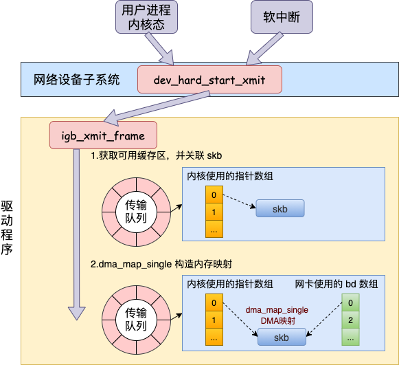

### 输入URL到浏览器发生了什么

https://blog.csdn.net/weixin_40851188/article/details/89032946

1. 从浏览器接收到url到开启网络请求线程到构建一个完整的http请求，交给协议栈

    > 1.1 多进程浏览器，每个tab相当一个进程，每个进程包含有多个线程,触发浏览器的**事件触发进程**。
    >
    > 1.2 解析URL（根据特定的格式解析URL每一部分完成字符编码等操作）
    >
    > 1.3 网络请求线程（发送网络请求，开辟进程）
    >
    > 1.4 生成HTTP消息(浏览器生成，操作系统协议栈发送出去，在这之前需要DNS)
    >
    > 1.5 通过Scoket库发送HTTP请求，使用DNS解析域名成为IP（DNS解析缓存，递归解析，迭代解析，DNS负载均衡）
    >
    > 1.6 如果浏览器有缓存，直接使用浏览器缓存，否则使用本机缓存，再没有的话就是用host。如果本地没有，就向dns域名服务器查询（当然，中间可能还会经过路由，也有缓存等），查询到对应的IP。优化可以考虑CDN加速，dns-prefetch
    >
    > 1.7 通过调用scoket库connect，创建套接字，（需要指定描述符、服务器IP地址和端口号），然后交给操作系统的协议栈。

2. 操作系统拿到HTTP消息到TCP/IP协议再到网卡将数据包转为电信号发送出去

    套接字主要是让我们能够发送信息的一个管道，它不是一个实体，或者可以说这些**控制信息就是套接字的实体，或者说存放控制信息的内存空间就是套接字的实体**。

    >   **从网络的角度来看：**
    >
    >   > 2.1 通过套接字，调用操作系统的Socket来进行TCP连接(其中涉及了TCP三次握手，四次挥手，拥塞控制等知识)，scoket链接上之后就会得到一系列控制信息，这些控制信息构成TCP头部，添加到HTTP消息前面(
    >   >
    >   > 2.2 在TCP阶段，可能会将HTTP消息进行拆分或者等待长度达到再发送，并且会在HTTP消息的基础上加上TCP头部，TCP中有端口号等信息
    >   >
    >   > 2.3 TCP采用可序号，确认，重传和流量控制，拥塞控制来保证可靠性
    >   >
    >   > 2.4 然后交给IP,IP协议会在TCP协议上添加两个头部:IP头部和MAC头部，IP头部根据发送和接收方的IP地址，而MAC头部的MAC地址需要通过**ARP**得到发送的中间路由器的地址（注意：这里IP地址是接收方的，MAC地址是中间路由器的）{IP协议这块又涉及了网络号，主机号，网关等知识}
    >   >
    >   > 2.5 ARP协议找到MAC的过程，ARP缓存更新问题
    >   >
    >   > 2.6网卡拿到网络包，在开头加上报头和起始帧分界符，在末尾加上用于检测错误的帧校验序列
    >   >
    >   > 2.7接着网卡和网卡驱动将数据报转为电信号通过传输介质（双绞线，光纤）发送出去（0,1比特），前往集线器
    >
    >   **从系统的角度来看：**
    >
    >   > 2.1 通过send系统调用，从用户态切换到内核态，1.找到socket控制信息2.构造一个struct msghdr 对象，把用户传入的数据，比如 buffer地址、数据长度啥的，统统都进行封装.剩下的交给协议栈处理。
    >   >
    >   > 2.2 tcp_sendmsg/udp_sendmsg会申请一个内核态的 skb 内存，将用户待发送的数据拷贝进去(**这里就涉及一次或者多次拷贝的开销**)，但是不一定立即发送，先存在缓存区中 ，等待满足条件再进行发送
    >   >
    >   > 2.3 在tcp_write_xmit函数中完成滑动窗口、拥塞控制，tcp_transmit_skb()中克隆一个新的 skb(为什么复制新的？因为在发送完成后，这个skb会被释放，而TCP又是支持丢失重传的，所以只有等收到ACK的时候才会真正删除)，添加TCP头部。离开传输层
    >   >
    >   > 2.4 在网络层里主要处理路由项查找(ip_queue_xmit )、IP 头设置、netfilter 过滤(**如果设置了非常复杂的 netfilter 规则，会导致你的进程 CPU 开销会极大增加**)、skb 切分（大于 MTU 的话）
    >   >
    >   > 2.5 到达邻居子系统（位于网络层和数据链路层中间的一个系统，对网络层提供一个封装，让网络层不必关心下层的地址信息，让下层来决定发送到哪个 MAC 地址），发送ARP请求封装MAC头
    >   >
    >   > 2.6 通过 dev_queue_xmit 进入到网络设备子系统中，在这里选择网卡的发送队列，之后设置一个软中断，是的net_tx_action 通过while循环去遍历整个队列，最终调用到驱动程序里的入口函数 dev_hard_start_xmit（在驱动函数里，将 skb 会挂到 RingBuffer上）将 skb 数据映射到网卡可访问的内存 **DMA 区域**
    >   >
    >   > 
    >   >
    >   > 2.7 当数据发送完成以后，网卡设备会触发一个硬中断来释放内存，硬中断是cpu处理会设置一个软中断执行RingBuffer 内存的清理工作
    >   >
    >   > 2.8 最后虽然已经基本完成了，但是因为传输层需要保证可靠性，所以 **skb 其实还没有删除。它得等收到对方的 ACK 之后才会真正删除**
    >   >
    >   > [具体图示参考](../Linux\Linux 网络包发送过程.md)
    >   >
    >   > **发送网络数据的时候都涉及到哪些内存拷贝操作？**
    >   >
    >   > 这里的内存拷贝，我们只特指待发送数据的内存拷贝。
    >   >
    >   > 第一次拷贝操作是内核申请完 skb 之后，这时候会将用户传递进来的 buffer 里的数据内容都拷贝到 skb 中。如果要发送的数据量比较大的话，这个拷贝操作开销还是不小的。
    >   >
    >   > 第二次拷贝操作是从传输层进入网络层的时候，每一个 skb 都会被克隆一个新的副本出来。网络层以及下面的驱动、软中断等组件在发送完成的时候会将这个副本删除。传输层保存着原始的 skb，在当网络对方没有 ack 的时候，还可以重新发送，以实现 TCP 中要求的可靠传输。
    >   >
    >   > 第三次拷贝不是必须的，只有当 IP 层发现 skb 大于 MTU 时才需要进行。会再申请额外的 skb，并将原来的 skb 拷贝为多个小的 skb。
    >
    >   **问题：如果url是localhost又是如何的呢？**如果对方和自己处于同一个子网中，通过上面的操作就可以得到对方的MAC地址（如果找不到，包就会发送失败）。我们将这个MAC地址写入MAC头部，

3. 从网卡出来的电信号到集线器，交换机，路由器

    > 1.从网卡出来通过双绞线到达集线器，集线器的作用就是将包广播到他所在的网段，然后每个电脑都能收到包，
    >
    > 2.集线器出来需要进入交换机，交换机中有MAC表可以根据MAC地址将包发送到对应端口，他不像集线器一样会将包转发到所有端口，而是根据地址表转发到固定端口。
    >
    > 3.接下来到达路由器，路由器主要是先根据包头的FCS进行校验，MAC地址找到路由表确定下一个需要发送的IP地址，然后通过ARP协议找到对应路由器的MAC地址，封装进MAC头部，发往下一个路由器。

4. 接入网

    > 4.1 包会进入<u>互联网接入路由器</u>（会将私有地址转为公有地址），互联网接入路由器遵循接入网规则进行包转发，接入网有ADSL、FTTH、CATV、电话线、ISDN
    >
    > 4.2 互联网接入路由器会在网络包前面加上MAC头部、PPPoE头部、PPP头部总共3种头部，然后发送给ADSL Modem
    >
    > 4.3 ADSL Modem将包拆分成信元，经过**调制**（振幅调制ASK相位调制（PSK）相结合的正交振幅调制（QAM））并转换成电信号发送给分离器，
    >
    > 4.4 分离器将电话和ADSL的信号进行分离
    >
    > 4.5 通过电话线到达电话局，在传到BAS,BAS负责将ATM信元还原成网络包并转发到互联网内部
    >
    > 4.5 包到达互联网内部将数字信号转为电信号再转为光信号，传入互联网内部
    >
    > 4.6 再到达网络运行商的BAS

5. 网络运营商

    >   5.1 网络运营商首先会进行**用户认证和配置下发功能**，验证成功则下发公有IP地址
    >
    >   5.2 运营商们通过交换路由信息，来进行包的转发

6. 从服务器接收到请求到对应后台接收到请求（这一部分可能涉及到负载均衡，安全拦截以及后台内部的处理等等）

    > ###### 3.1 安全拦截
    >
    > **防火墙(包过滤，应用层网关，电路层网关)**
    >
    > 包过滤规则：通过ip地址，端口号。tcp控制位，控制web服务器联网，控制外网无法访问内网。
    >
    > ###### 3.2 负载均衡
    >
    >   1. 负载均衡方法
    >   2. 缓存服务器（缓存更新方法）
    >   3. （代理服务器）正向代理，反向代理，透明代理
    >  5. 内容分发服务CDN
    >
    > 3.3  后台业务逻辑的处理及返回
    >
    > ​		服务器端的套接字的建立和通信过程和端口号

7. web服务器接收包操作

>   1.   网卡接收：转为数字信息，包末尾的帧校验序列（FCS）来校验错误，检查MAC头部中的接收方MAC地址，看看这个包是不是发给自己的，保存在网卡内部的缓冲区
>   2.   IP模块接收：检查IP头部, 查看IP地址, 检查是否分片，检查上层协议，交给TCP/UDP；
>   3.   TCP模块接收：TCP模块会判断是连接包还是数据包，连接包记录控制信息，数据包会将消息放在缓冲区中，向客户端返回ACK
>   4.   服务器将传来的目录映射为真实的目录，并读取文件资源，返回响应消息。
>   5.   响应消息包括（http头部、响应码、报文结构、cookie,cookie优化，以及编码解码，如gzip压缩,http缓存头部，etag，catch-control等）
>

> 4.1 http报文结构（通用头部，请求/响应头部，请求/响应体）
>
> 4.2 cookie以及优化
>
> 4.3 gzip压缩
>
> 4.4 长链接&短连接
>
> 4.5 http 2.0
>
> 4.6 https

8.   浏览器接收到http数据包后的解析流程（这部分包括dom树、css规则树、合并成render树，然后layout、painting渲染、复合图层合成、GPU绘制、外链资源处理、loaded和domcontentloaded等）
9.   CSS的可视化格式模型（元素的渲染规则，如css三大模型，BFC，IFC等概念）
10.   JS引擎解析过程（JS的解释阶段，预处理阶段，执行阶段生成执行上下文，VO，作用域链、回收机制等等）