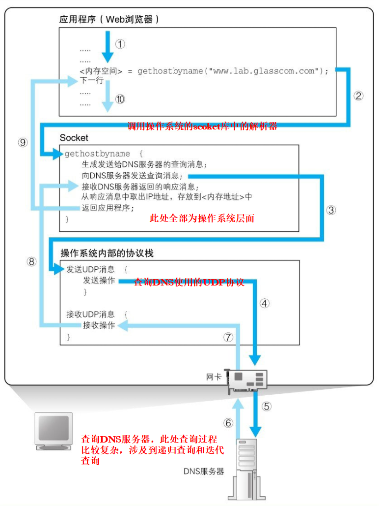
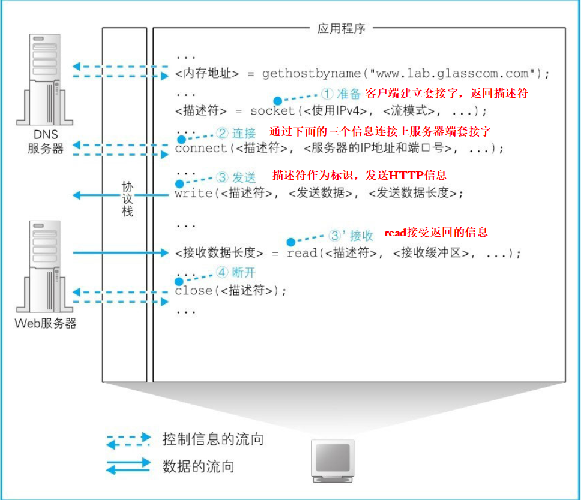

浏览器生成和发送消息
--------------------

> 1. 生成HTTP请求消息
> 2. 向DNS服务器查询Web服务器的IP地址
> 3. 全世界DNS服务器的大接力
> 4. 委托协议栈发送消息

### 生成HTTP请求消息

> 本节包括 1.浏览器生成HTTP消息，2.通过DNS获取域名，3.委托操作系统将消息发送出去.

***网址：***也叫URL,是浏览器需要通过URL来获取给定的资源，根据访问目标的不同，URL的写法也会不同。访问Web服务器和FTP服务器时，URL中会包含服务器的域名和要访问的文件的路径名等，发邮件的URL则包含收件人的邮件地址。此外，根据需要，URL中还会包含用户名、密码、服务器端口号等信息。

##### 浏览器对我们给定的URL进行解析

拆分协议HTTP+//+web服务器名+端口+/+数据源文件的路径名

##### 生成HTTP请求消息

HTTP请求主要包含两个大操作：对什么操作（服务器路径名）、怎么操作（GET,POST,PUT,DELTE）

返回相应的状态码(不同状态码的含义)

HTTP消息的组成：

> 请求行：告诉Web服务器它应该进行怎样的操作
>
> 消息头：每行包含一个用于请求的附加信息
>
> 消息体：客户端向服务器端发送的数据

##### 请求后会收到响应

在响应消息中，第一行的内容为状态码和响应短语，用来表示请求的执行结果是成功还是出错。状态码和响应短语表示的内容一致，但它们的用途不同。状态码是一个数字，它主要用来向程序告知执行的结果（表1.3）；相对地，响应短语则是一段文字，用来向人们告知执行的结果。

##### DNS服务器查询IP地址

IP = 网络号+主机号

但网络号和主机号的位数是不固定的，所以需要其它方式来标识这两个号（**子网掩码技术**）

但是我们在输入网址的时候使用的是www.XXX.com这样的域名,所以需要将域名转为IP地址,这时就需要**DNS技术**

下面我们详细探索一下DNS过程:

> ​	Socket库是用于调用网络功能的程序组件集合

首先浏览器会使用操作系统的**Scoket库中的组件**，发送HTTP请求，就是调用socket库中的解析器，调用解析器后，解析器会向DNS服务器发送查询消息，然后DNS服务器会返回响应消息。响应消息中包含查询到的IP地址，解析器会取出IP地址，并将其写入浏览器指定的内存地址中，具体过程如下图：

###### DNS服务器具体查询过程

如果要查询www.lab.glasscom.com这个域名对应的IP地址，客户端会向DNS服务器发送包含以下信息的查询消息。

（a）**域名**=www.lab.glasscom.com

（b） **Class** = IN

在最早设计DNS方案时，DNS在互联网以外的其他网络中的应用也被考虑到了，而Class就是用来识别网络的信息。不过，如今除了互联网并没有其他的网络了，因此Class的值永远是代表互联网的IN

（c）**记录类型**=A

表示域名对应何种类型的记录。例如，当类型为A时，表示域名对应的是IP地址；当类型为MX时，表示域名对应的是邮件服务器。对于不同的记录类型，服务器向客户端返回的信息也会不同

根域服务器存在于互联网的每一台电脑中，每一个DNS服务器都会注册到他上一级的服务器当中，根域服务器属于最定层

客户端首先会访问最近的一台DNS服务器（也就是客户端的TCP/IP设置中填写的DNS服务器地址），假设我们要查询www.lab.glasscom.com这台Web服务器的相关信息（图1.16①）。由于最近的DNS服务器中没有存放www.lab.glasscom.com这一域名对应的信息，所以我们需要**从顶层开始向下查找**。最近的DNS服务器中保存了根域DNS服务器的信息，因此它会将来自客户端的查询消息转发给根域DNS服务器（图1.16②）。根域服务器中也没有www.lab.glasscom.com这个域名，但根据域名结构可以判断这个域名属于com域，因此根域DNS服务器会返回它所管理的com域中的DNS服务器的IP地址，意思是“虽然我不知道你要查的那个域名的地址，但你可以去com域问问看”。接下来，最近的DNS服务器又会向com域的DNS服务器发送查询消息（图1.16③）。com域中也没有www.lab.glasscom.com这个域名的信息，和刚才一样，com域服务器会返回它下面的glasscom.com域的DNS服务器的IP地址。以此类推，只要重复前面的步骤，就可以顺藤摸瓜找到目标DNS服务器（图1.16⑤），只要向目标DNS服务器发送查询消息，就能够得到我们需要的答案，也就是www.lab.glasscom.com的IP地址了。

##### 委托协议栈发送消息

和向DNS服务器查询IP地址的操作一样，发送消息也需要使用Socket库中的程序组件。不过，查询IP地址只需要调用一个程序组件就可以了，但是这里需要按照指定的顺序**调用多个程序组件**。

简单来说，收发数据的两台计算机之间连接了一条数据通道，数据沿着这条通道流动，最终到达目的地，这条通道被我们称为管道。

在进行收发数据操作之前，双方需要先建立起这条管道才行。建立管道的关键在于管道两端的数据出入口，这些出入口称为**套接字。我们需要先创建套接字，然后再将套接字连接起来形成管道。**

注意委托协议栈发送消息这个过程完全是操作系统来完成的，应用程序是完全不需要参与的

主要分为四个阶段：

***创建套接字阶段***:

***连接阶段：把管道接上去***：当调用connect时，需要指定描述符、服务器IP地址和端口号这3个参数。**描述符**，就是在创建套接字的时候由协议栈返回的那个描述符；**服务器IP地址**，就是通过DNS服务器查询得到的我们要访问的服务器的IP地址；当同时指定IP地址和端口号时，就可以明确识别出某台具体的计算机上的某个具体的套接字（端口号不需要给定，对于特定的应用程序，事先已经默认）

***通信阶段：传递消息***：应用程序需要在内存中准备好要发送的数据。根据用户输入的网址**生成的HTTP请求消息**就是我们要发送的数据。接下来，调用scoket库中的write时，**需要指定描述符和发送数据**，然后协议栈就会将数据发送到服务器。由于套接字中已经保存了已连接的通信对象的相关信息，所以只要通过描述符指定套接字，就可以识别出通信对象，并向其发送数据。

当消息返回后，需要执行的是接收消息的操作。接收消息的操作是通过Socket库中的read程序组件委托协议栈来完成的。调用read时需要指定用于**存放接收到的响应消息的内存地址**，这一内存地址称为接收缓冲区。当服务器返回响应消息时，read就会负责将接收到的响应消息存放到接收缓冲区中。

***断开阶段：收发数据结束***：

调用Socket库的close程序组件进入断开阶段，由于每次收发操作都需要连接和断开，当一个网页请求过多的时候，就会造成资源的浪费，于是在HTTP1.1版本就有了在一次连接中收发多个请求和响应的方法，也叫长连接。

