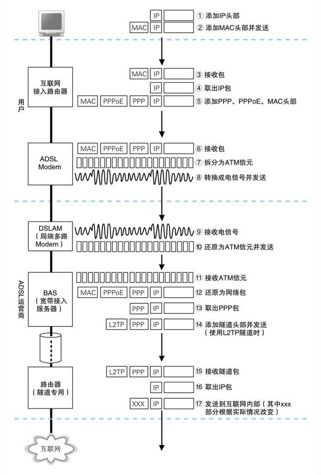
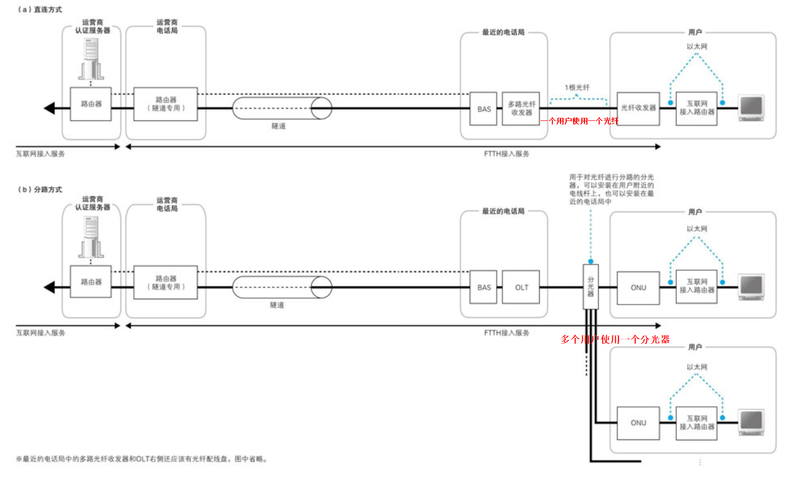
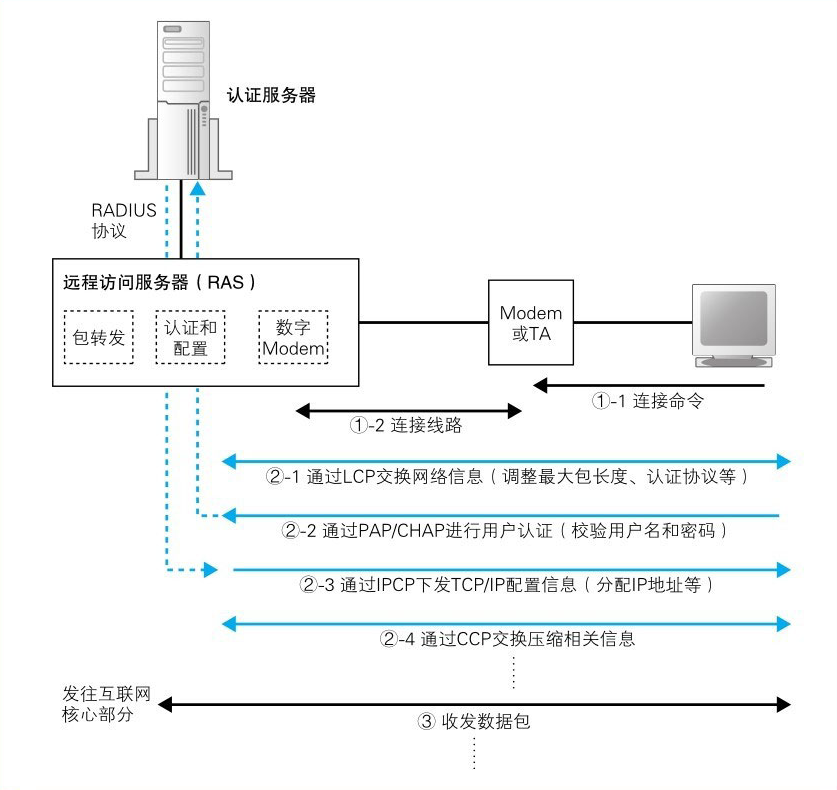
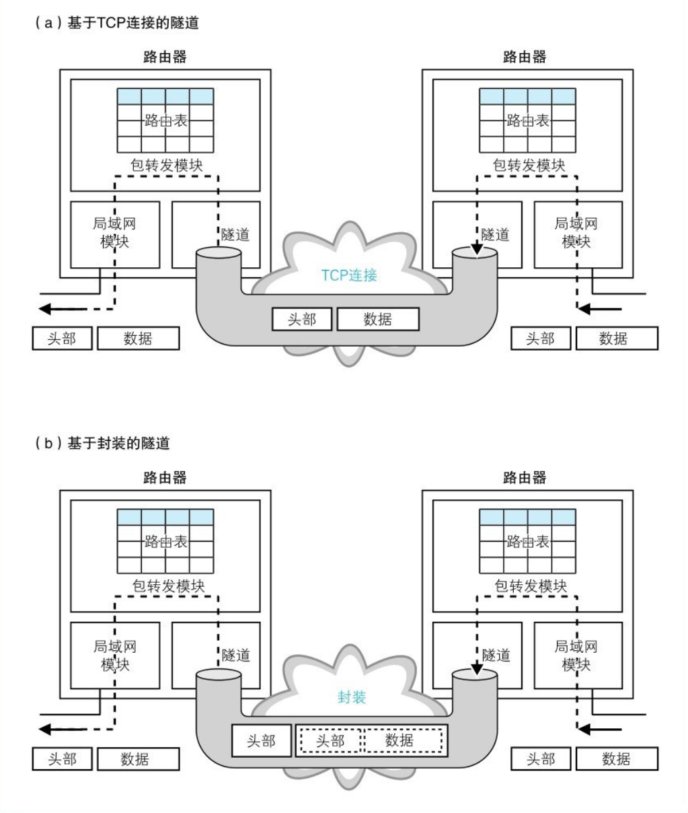
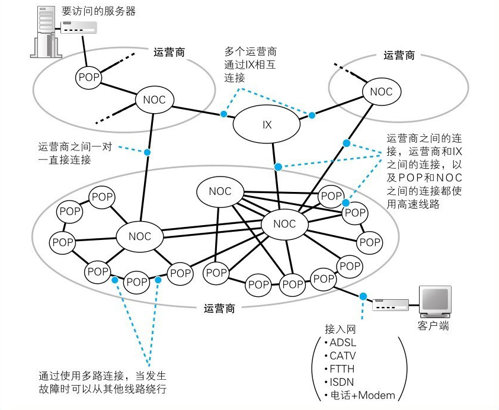
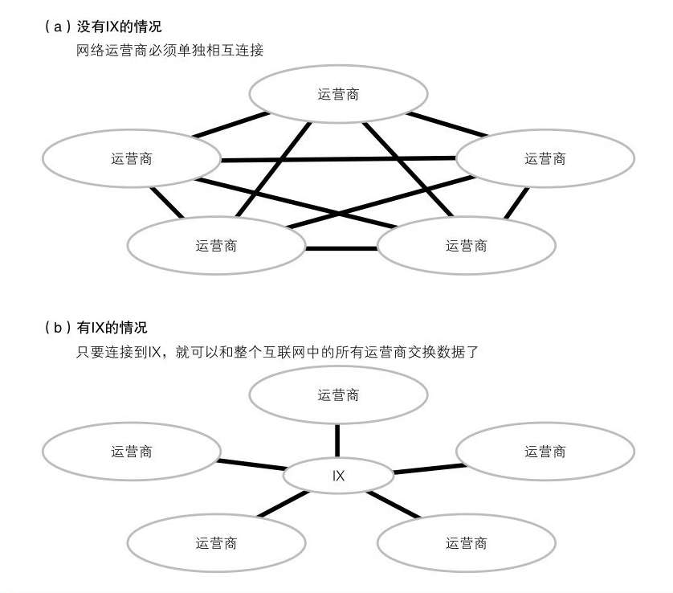

接入网和网络运营商
------------------

### ADSL接入网的结构和工作方式

##### 接入网是什么

互联网中的路由器上有超过10万条路由记录，而且这些记录还在不断变化，当出现线路故障时，或者新的公司加入互联网时，都会引发路由的变化，不过，互联网接入路由器发送网络包的操作和以太网路由器有一点不同，互联网接入路由器是按照接入网规则来发送包的。**所谓接入网**，就是指连接互联网与家庭、公司网络的通信线路。一般家用的接入网方式包括ADSL、FTTH、CATV、电话线、ISDN等，公司则还可能使用专线。

##### ADSL Modem将包拆分成信元

>  ADSL Modem就是我们平时说的**猫**。

用户端路由器发出的网络包通过ADSL Modem和电话线到达**电话局**，然后到达**ADSL的网络运营商**（即ISP，互联网服务提供商）

互联网接入路由器将包发送出去之后，包就到达了ADSL Modem （图4.3⑥），然后，ADSL Modem会把包拆分成很多小格子（图4.3⑦），每一个小格子称为一个信元。信元是一个非常小的数据块，开头是有5个字节的头部，后面是48个字节的数据，用于一种叫作ATM的通信技术，**ADSL Modem将包拆分成信元，并转换成电信号发送给分离器**。如下图：

#####  ADSL将信元“调制”成信号

网络报拆分成信元后，还需要**转换为电信号**

**以太网**采用的是用方波信号表示0和1的方式，这种方式很简单，但同样是将数字信息转换成模拟信号，**ADSL**采用的方法要复杂一些。其中有两个原因，一个原因是方波信号的波形容易失真，随着距离的延长错误率也会提高；另一个原因是方波信号覆盖了从低频到高频的宽广频段，信号频率越高，辐射出来的电磁噪声就越强，因此信号频谱太宽就难以控制噪声

ADSL Modem采用了一种用**圆滑波形（正弦波）**对信号进行合成来表示0和1的技术，这种技术称为**调制**。调制有很多方式，ADSL采用的调制方式是**振幅调制（ASK）和相位调制（PSK）相结合的正交振幅调制（QAM）方式**

***振幅调制***是用信号的强弱，也就是信号振幅的大小来对应0和1的方式。两个振幅可以表示四个级别，三个表示8个级别

***相位调制***根据信号的相位来对应0和1的方式。

***正交振幅调制：***通过增加振幅和相位的级别，就可以增加能表示的比特数。例如，如果振幅和相位各自都有4个级别，那么组合起来就有16个级别，也就可以表示4个比特的值

##### ADSL通过使用多个波来提高速率

信号是一个频率的波，实际上信号不一定要限制在一个频率。不同频率的波可以合成，也可以用滤波器从合成的波中分离出某个特定频率的波。因此，我们可以使用多个频率合成的波来传输信号，这样一来，能够表示的比特数就可以成倍提高了。

ADSL使用间隔为4.3125 kHz的上百个不同频率的波进行合成，每个波都采用正交振幅调制，并根据噪声等条件的不同，每个波表示的比特数是可变的，噪声小的频段可以给波分配更多的比特，噪声大的频段则给波分配较少的比特，每个频段表示的比特数加起来，就决定了整体的传输速率

##### 分离器的作用

分离器的作用是要将**电话和ADSL的信号进行分离**。电话线传入的信号是电话的语音信号和ADSL信号直接混合在一起的，如果这个混合信号直接进入电话机，ADSL信号就会变成噪音，导致电话难以听清。为了避免这样的问题，就需要通过分离器将传入的信号分离，以确保ADSL信号不会传入电话机。

具体来说，**分离器的功能是将一定频率以上的信号过滤掉，也就是过滤掉了ADSL使用的高频信号**，这样一来，只有电话信号才会传入电话机，但对于另一头的ADSL Modem，则是传输原本的混合信号给它。**ADSL Modem内部已经具备将ADSL频率外的信号过滤掉的功能**，因此不需要在分离器进行过滤。

##### 从用户到电话局

接下来信号会进入电线杆上架设的电话电缆，

电话电缆在用户住宅附近一般是架设在电线杆上，但中途会沿电线杆侧面的金属管进入地下

在电话局附近，电话线都是埋在地下的。由于电话局附近的地下电缆很多，集中埋设电缆的地方就形成了一条地道，这部分称为电缆隧道，通过电缆隧道进入电话局后，电缆会逐根连接到电话局的MDF上

#####  噪声的干扰

##### 通过DSLAM到达BAS

> BAS负责将ATM信元还原成网络包并转发到互联网内部。

信号通过电话线到达电话局之后，会经过配线盘、分离器到达DSLAM（相当于多路ADSL）。

电信号会被还原成数字信息——信元。

DSLAM通过读取信号波形，根据振幅和相位判断对应的比特值，将信号还原成数字信息。

信元从DSLAM出来之后，会到达一个叫作BAS的包转发设备。

BAS会将收到的包前面的MAC头部和PPPoE头部丢弃，取出PPP头部以及后面的数据。

BAS会在包的前面加上隧道专用头部，并发送到隧道的出口。

网络包会到达隧道出口的隧道专用路由器，在这里隧道头部会被去掉，IP包会被取出，并被转发到互联网内部。

如下图**用户端电话局部分**

### 光纤接入网（FTTH）

> 本节介绍另外一种和ADSL一样的接入网技术——-**FTTH**，是一种基于光纤的接入网技术

##### 光纤的原理

光纤是由一种双层结构的纤维状透明材质（**玻璃和塑料**）构成的，通过在里面的纤**芯中传导光信号来传输数字信息**，

ADSL信号是由多个频段的信号组成的，比较复杂，但光信号却非常简单，亮表示1，暗表示0。

##### 单模与多模

单模光纤和多模光纤在光的传导方式上有所不同，这决定了它们的特性也有所不同。多模光纤中可以传导多条光线，这意味着能通过的光线较多，对光源和光敏元件的性能要求也就较低，从而可以降低光源和光敏元件的价格，相对地，单模光纤的纤芯中只能传导一条光线，能通过的光线较少，相应地对于**光源和光敏元件的性能要求就较高**，但**信号的失真会比较小**。

信号失真与光在纤芯传导时反射的次数相关。多模光纤中，多条反射角不同的光线同时传导，其中反射角越大的光线反射次数越多，走过的距离也就越长；相对地，反射角越小的光线走过的距离越短。光通过的距离会影响其到达接收端的时间，也就是说，通过的距离越长，到达接收端的时间越长。结果，多条光线到达的时间不同，信号的宽度就会被拉伸，这就造成了失真。因此，**光纤越长，失真越大**，当超过允许范围时，通信就会出错。

##### 通过光纤分路来降低成本

有两种使用光纤代替ADSL的方式：

1. 用一根光纤直接从用户端连接到最近的电话局，用户端的光纤收发器将以太网的**电信号转换成光信号**，不会像ADSL一样还需要将包拆分成信元 。接下来，光信号通过连接到光纤收发器的光纤直接**到达BAS前面的多路光纤收发器**。然后，多路光纤收发器将**光信号转换成电信号**，BAS的端口接收之后，将包转发到互联网内部。

为了区分输出光信号和输入光信号，采用不同波长的光来区分他们，像这样在一条光纤中使用不同的波长传输多个光信号的方式叫作**波分复用**

2. 另一种光纤的接入方式是在用户附近的电线杆上安装一个名为**分光器的设备**，通过这个设备让光纤分路，同时连接多个用户，

### 接入网中使用的PPP和隧道

##### 用户认证和配置下发

上面讲过，用户发送的网络包会通过ADSL和FTTH等接入网到达运营商的BAS

BAS首先会负责**用户认证和配置下发功能**，ADSL和FTTH接入网中，都需要先输入用户名和密码，登录之后才能访问互联网，而BAS就是登录操作的窗口。BAS使用PPPoE方式来实现这个功能。

在接入互联网时，必须为计算机分配一个公有地址，但这个地址并不是事先确定的。因为在拨号连接时，可以根据电话号码来改变接入点，而不同的接入点具有不同的IP地址，因此无法事先在计算机上设置这个地址。所以，在连接时运营商会向计算机下发TCP/IP配置信息，其中就包括为计算机分配的公有地址。

##### 在以太网上传输PPP消息

TODO

##### 通过隧道将网络包发送给运营商

在BAS和运营商路由器之间的ADSL/FTTH接入服务商的网络中建立一条隧道，将用户到BAS的接入网连接起来，就形成了一条从用户一直到运营商路由器的通道，网络包通过这条通道，就可以进入互联网内部了

隧道有几种实现方式，

* TCP连接是其中一种实现方式。

* 另一种基于封装（encapsulation）的隧道实现方式

  

  **只要能够将包原封不动搬运到另一端，从原理上看就都可以用来建立隧道。**

##### 接入网的整体工作过程

1. 互联网接入路由器通过PPPoE的发现机制查询BAS的MAC地址。

2. 进入用户认证和下发配置的阶段，
3. BAS下发的TCP/IP参数会被配置到互联网接入路由器的BAS端的端口上，这样路由器就完成接入互联网的准备了。

4. 客户端就会开始发送用来访问互联网的网络包，
5. BAS在收到用户路由器发送的网络包之后，会去掉MAC头部和PPPoE头部，然后用隧道机制将包发送给网络运营商的路由器。

##### 不分配IP地址的无编号端口

一对一连接的端口可以不分配IP地址，这种方式称为无编号。

##### 互联网接入路由器将私有地址转换成公有地址

互联网接入路由器在转发包时需要进行**地址转换**。刚才我们讲过，**BAS会向用户端下发TCP/IP的配置信息**，如果将这些信息配置在计算机上，就相当于计算机拥有了公有地址，这种情况下不需要进行地址转换也可以访问互联网。其实TCP/IP原本的设计就是这样的。然而，如果使用路由器来上网，BAS下发的参数就会被配置在路由器上，而且公有地址也是分配给路由器的。这时，计算机会被分配一个私有地址，计算机发送的包需要通过路由器进行地址转换然后再转发到互联网中

##### 除PPPoE之外的其他方式

上面的方式都是基于PPPoE方式的，还有一些其他的方式**PPPoA，DHCP**

### 网络运营商的内部

现在网络包已经通过接入网，到达了网络运营商的路由器。这里是互联网的入口，网络包会从这里进入**互联网内部**（之后其在互联网内部还是通过多个路由器转发到达目的地）

互联网其实就是由多个运营商网络相互连接的，由多个不同的POP组成（接入点）

POP中包括各种类型的路由器，路由器的基本工作方式是相同的，但根据其角色分成了不同的类型

从上面看分别有专线，电话、ISDN等拨号方式的接入网，PPPoE方式的ADSL和FTTH

**NOC是运营商的核心设备**，从POP传来的网络包都会集中到这里，并从这里被转发到离目的地更近的POP，或者是转发到其他的运营商。这里也需要配备高性能的路由器。

### 跨越运营商的网络包

##### 运营商之间的连接

***同一个运营商：***POP路由器的路由表中应该有相应的转发目标，直接通过转发，交给下一个POP或者NOC

***服务器的运营商和客户端的运营商不同:*****网络包需要先发到服务器所在的运营商**，这些信息也可以在路由表中找到，这是因为运营商的路由器和其他运营商的路由器也在交换路由信息。这个信息交换的过程稍后再讲，我们暂且认为路由表中能找到对方运营商的路由信息，这时**网络包会被转发到对方运营商的路由器**。

##### 运营商之间的路由信息交换

> 那到底运营商之间是如何交换路由信息，并对路由器进行自动更新的？

只要让**相连的路由器告知路由信息**。只要获得了**对方的路由信息**，就可以知道对方路由器连接的所有网络，将这些信息写入自己的路由表中，也就可以向那些网络发送包了。而且在**获得对方的路由信息之后**，我们也需要**将自身的路由信息告知对方**。对方也可以将发往我们所在子网的包转发过来。这个路由信息交换的过程是由路由器自动完成的，这里使用的机制称为**BGP**。

路由交换方式可分为两类：

1. ***转接：***将互联网中的路由全部告知对方。如果运营商D将互联网上所有路由都告知运营商E，则运营商E不但可以访问运营商D，还可以访问运营商D后面的运营商B、A和C。然后，通过运营商D就可以向所有的运营商发送网络包。

2. ***对等：***两个运营商之间仅将与各自网络相关的路由信息告知对方。这样只有双方之间的网络可以互相收发网络包

> **互联网内部使用BGP机制在运营商之间交换路由信息**

##### 与公司网络中自动更新路由表机制的区别

公司中，**路由信息是在所有路由器间平等交换**的，但运营商之间的路由交换是**在特定路由器间一对一进行的**。这样一来，运营商就可以只将路由信息提供给那些交了费的运营商，那些没交费的运营商也就无法将网络包发送过来了。

##### IX的必要性

**IX为网络交换中心**，如果运营商之间只存在一对一对等连接，那如果由多个不同的运营商，那就需要无数的线路将它们连接起来，所以我们可以考虑设置一个中心设备，通过其他运营商连接到中心线路来交换信息。

##### 运营商如何通过IX互相连接

运营商之间通过谈判签订合约，然后按照合约来交换路由信息，有了路由信息，我们才能IX和运营商之间的通信，实现网络包的收发
