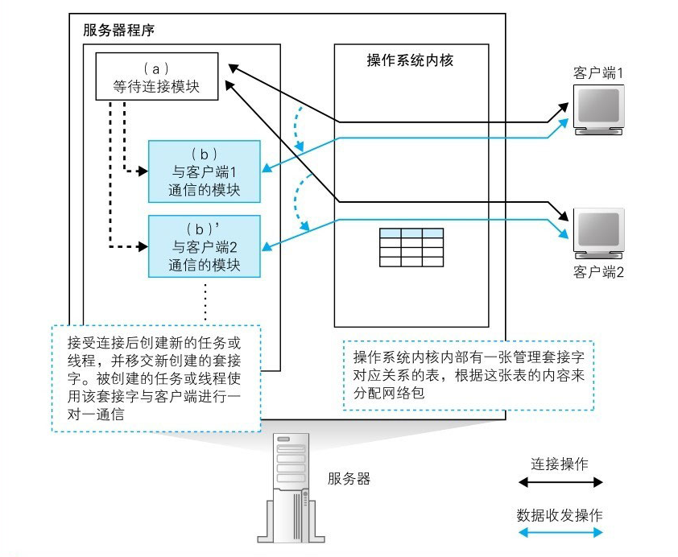
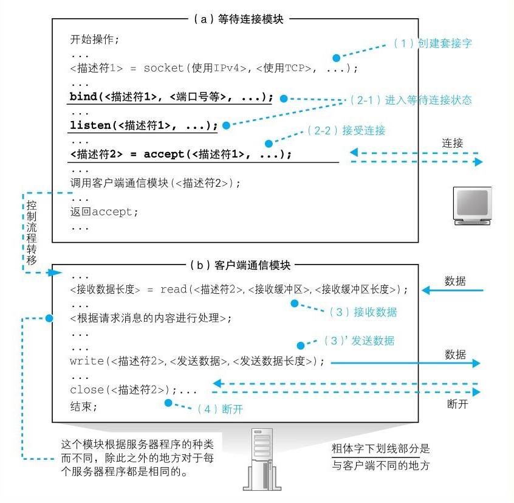
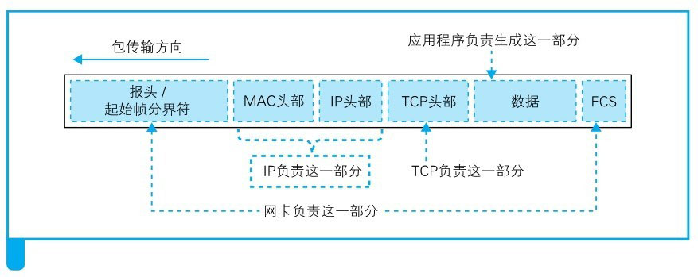

Web服务器响应
-------------

***问题：***服务器向客户端返回的响应消息不一定和客户端向服务器发送的请求消息通过相同的路由传输

路由器和交换机是不考虑请求包和响应包之间的关联的，而是将它们作为独立的包来对待，因此请求和响应是有可能通过不同的路由来传输的，**具体走哪条路由，是由路由器的路由表和交换机的地址表中的配置来决定的**

> 服务器的接收操作
>
> Web服务器程序解释请求消息并作出响应
>
> 浏览器接收响应消息并显示内容

### 服务器概览

##### 服务器程序的结构

服务器程序分成两个模块，即等待连接模块和负责与客户端通信的模块()

如上图所示：当服务器程序启动并读取配置文件**完成初始化操作**后，就会**运行等待连接模块**（a）。这个模块会创建套接字，然后进入等待连接的**暂停状态**。接下来，当客户端连发起连接时，这个模块会恢复运行并**接受连接**，然后启动**客户端通信模块**（b），并**移交完成连接的套接字**。接下来，客户端通信模块（b）就会使用已连接的套接字与客户端进行通信，通信结束后，这个模块就退出了。

当这种方法在每次客户端发起连接时都需要启动新的程序，这个过程比较耗时，响应时间也会相应增加。因此，还有一种方法是**事先启动几个客户端通信模块，当客户端发起连接时，从空闲的模块中挑选一个出来将套接字移交给它来处理**

##### 服务器端的套接字和端口号

即要确定某个套接字时，不仅使用服务器端套接字对应的端口号，还同时使用客户端的端口号再加上IP地址，总共使用下面4种信息来进行判断：**客户端IP地址，客户端端口号，服务器IP地址，服务器IP地址**

**使用描述符来指代套接字的原因如下。**

（1）等待连接的套接字中没有客户端IP地址和端口号

（2）使用描述符这一种信息比较简单

### 服务器的接收操作

##### 网卡将接收到的信号转换成数字信息

到达服务器的网络包其本质是电信号或者光信号，接收信号的过程和客户端是一样的，第一步是**网卡接收到信号，然后将其还原成数字信息**，

接下来需要根据**包末尾的帧校验序列（FCS）来校验错误**，即根据校验公式计算刚刚接收到的数字信息，然后与包末尾的FCS值进行比较。如果FCS错误，则需要丢弃包。

当FCS一致，即确认数据没有错误时，接下来需要**检查MAC头部中的接收方MAC地址，看看这个包是不是发给自己的**。

然后将还原出来的数字信号保存在网卡内部的缓冲区中，

> 总的来说：**网卡的MAC模块将网络包从信号还原为数字信息，校验FCS并存入缓冲区。**

存入缓冲区后，网卡需要通过中断将网络包到达的事件通知给CPU, 接下来，**CPU就会暂停当前的工作**，并切换到网卡的任务。然后，网卡驱动会开始运行，从网卡缓冲区中将接收到的包读取出来，根据MAC头部的以太类型字段判断协议的种类，并调用负责处理该协议的软件.

> 网卡驱动会根据MAC头部判断协议类型，并将包交给相应的协议栈。

##### IP模块的接收操作

当网络包转交到协议栈时，IP模块会首先开始工作，检查IP头部。IP模块首先会检查IP头部的格式是否符合规范，然后检查接收方IP地址，看包是不是发给自己的。当服务器启用类似路由器的包转发功能时，对于不是发给自己的包，会像路由器一样根据路由表对包进行转发。

确认包是发给自己的之后，接下来需要检查包有没有被分片。检查IP头部的内容就可以知道是否分片，如果是分片的包，则将包暂时存放在内存中，等所有分片全部到达之后将分片组装起来还原成原始包；如果没有分片，则直接保留接收时的样子，不需要进行重组。到这里，我们就完成了包的接收。

接下来需要检查IP头部的协议号字段，并将包转交给相应的模块。例如，如果协议号为06（十六进制），则将包转交给TCP模块；如果是11（十六进制），则转交给UDP模块。这里我们假设这个包被交给TCP模块处理，然后继续往下看。

> 协议栈的IP模块会检查IP头部，（1）判断是不是发给自己的；（2）判断网络包是否经过分片；（3）将包转交给TCP模块或UDP模块。

##### TCP模块处理连接包

>  如果收到的是**发起连接**的包，则TCP模块会（1）确认TCP头部的控制位SYN; （2）检查接收方端口号；（3）为相应的等待连接套接字复制一个新的副本；（4）记录发送方IP地址和端口号等信息。

##### TCP模块如何处理数据包

数据包到达时TCP模块是如何处理的呢？

需要根据IP头部中的发送方IP地址和接收方IP地址，以及TCP头部中的接收方端口号和发送方端口号共4种信息，找到上述4种信息全部匹配的套接字，找到4种信息全部匹配的套接字之后，TCP模块会对比该套接字中保存的数据收发状态和收到的包的TCP头部中的信息是否匹配，以确定数据收发操作是否正常，TCP模块会从包中提出数据，并存放到接收缓冲区中，与上次收到的数据块连接起来。这样一来，数据就被还原成分包之前的状态了

当收到的数据进入接收缓冲区后，TCP模块就会生成确认应答的TCP头部，并根据接收包的序号和数据长度计算出ACK号，然后委托IP模块发送给客户端，接下来，应用程序会调用Socket库的read来获取收到的数据，这时数据会被转交给应用程序。如果应用程序不来获取数据，则数据会被一直保存在缓冲区中，但一般来说，应用程序会在数据到达之前调用read等待数据到达

控制流程会转移到服务器程序，对收到的数据进行处理，也就是检查HTTP请求消息的内容，并根据请求的内容向浏览器返回相应的数据

> 收到数据包时，TCP模块会（1）根据收到的包的发送方IP地址、发送方端口号、接收方IP地址、接收方端口号找到相对应的套接字；（2）将数据块拼合起来并保存在接收缓冲区中；（3）向客户端返回ACK。

##### TCP模块的断开操作

服务器程序会调用Socket库的close, TCP模块会生成一个控制位FIN为1的TCP头部，并委托IP模块发送给客户端。当客户端收到这个包之后，会返回一个ACK号。接下来客户端调用close，生成一个FIN为1的TCP头部发给服务器，服务器再返回ACK号，这时断开操作就完成了，当断开操作完成后，**套接字会在经过一段时间后被删除**。

##### Web服务器程序解释请求消息并作出响应

当读取文件时，需要先查询虚拟目录与实际目录的对应关系，并将URI转换成实际的文件名后，才能读取文件并返回数据。

客户端看到的Web服务器目录是虚拟的，和实际的目录结构不同。Web服务器内部会将实际的目录名和供外部访问的虚拟目录名进行关联。

##### 运行CGI程序

URI指定的文件内容不仅限于HTML文档，**也有可能是一个程序**。在这个情况下，服务器不会直接返回文件内容，而是会运行这个程序，然后将程序输出的数据返回给客户端

##### Web服务器的访问控制

Web服务器的基本工作方式就是根据请求消息的内容判断数据源，并从中获取数据返回给客户端，不过在执行这些操作之前，Web服务器还可以**检查事先设置的一些规则**，**并根据规则允许或禁止访问**。这种根据规则判断是否允许访问的功能称为**访问控制**，一些会员制的信息服务需要限制用户权限的时候会使用这一功能。

Web服务器的访问控制规则主要有以下3种。

（1）客户端IP地址

（2）客户端域名

（3）用户名和密码

而且我们也可以根据域名来进行过滤，拿到客户端的IP地址然后根据DNS服务器反查域名，再根据域名规则进行过滤。

##### 返回响应消息

