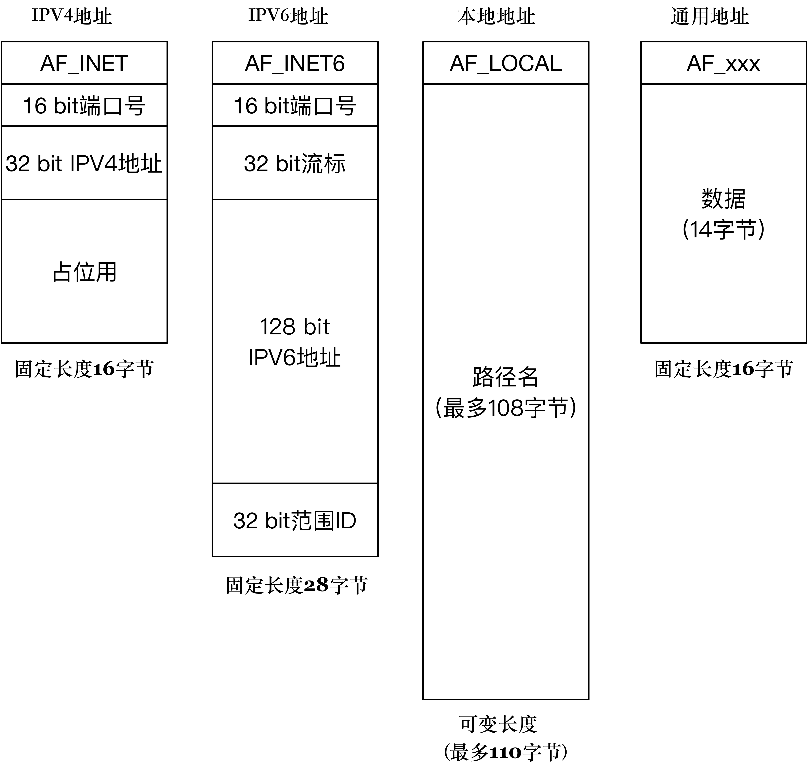

### 1.IP和Linux

GNU计划：在自由软件基金会统一组织下，相继续推出了编译器 GCC、调试器 GDB、Bash Shell 等运行于用户空间的程序，为Linux创造了一个合适的运行环境

### 2.客户端-服务器端

客户端发送信息，服务器接受请求进行返回，无论是客户端，还是服务器端，它们运行的单位都是<u>进程（process）</u>，而不是机器。

>   端口最多65536个，子网掩码用来区分网络号和主机号，域名系统：根, 顶级,二级，三级，
>
>   TCP：字节流套接字；UDP: 数据报套接字

### 3.套接字和地址


上图右侧先 初始化服务器socket，执行 bind绑定端口，listen，accpet

套接字格式：

```c
struct sockaddr{
  //表示使用什么样的方式对地址进行解释和保存,AF_LOCAL本地地址，AF_INET IPV4地址，AF_INET6 IPV6地址
    sa_family_t sa_family;  /* 地址族.  16-bit*/
    char sa_data[14];   /* 具体的地址值 112-bit */
  }; 
```

IPV4地址族的结构：

```c
/* IPV4 套接字地址，32bit 值.  */
typedef uint32_t in_addr_t;
struct in_addr
  {
    in_addr_t s_addr;
  };
/* 描述 IPV4 的套接字地址格式  */
struct sockaddr_in
  {
    sa_family_t sin_family; /* 16-bit  为AF_INET*/
    in_port_t sin_port;     /* 端口口  16-bit*/
    struct in_addr sin_addr;    /* Internet address. 32-bit 最多支持的地址数就是 2 的 32 次方，大约是 42 亿*/
    /* 这里仅仅用作占位符，不做实际用处  */
    unsigned char sin_zero[8];
  };
//-------------------------------------------------------------------------------------------------
truct sockaddr_in6
  {
    sa_family_t sin6_family; /* 16-bit */
    in_port_t sin6_port;  /* 传输端口号 # 16-bit */
    uint32_t sin6_flowinfo; /* IPv6 流控信息 32-bit*/
    struct in6_addr sin6_addr;  /* IPv6 地址 128-bit */
    uint32_t sin6_scope_id; /* IPv6 域 ID 32-bit */
  }
```



### 4.Scoket建立TCP三次握手

##### 服务端准备连接的过程

1.   创建套接字

     >   int socket(int domain, int type, int protocol)
     >
     >   domain 就是指 PF_INET、PF_INET6 以及 PF_LOCAL 等，表示什么样的套接字
     >
     >   type: SOCK_STREAM代表TCP；SOCK_DGRAM代表UDP,SOCK_RAW代表原始套接字；
     >
     >   protocol 原本是用来指定通信协议的，但现在基本废弃。

2.   bind,调用 bind 函数把套接字和套接字地址绑定，就像去电信局登记我们的电话号码一样，这样的套接字才能被别人使用

     >   bind(int fd, sockaddr * addr, socklen_t len)
     >
     >   根据 len 字段判断传入的参数 addr 该怎么解析，len 字段表示的就是传入的地址长度
     >
     >   fd為文件描述符

3.   listen 通过 listen 函数，可以将原来的"主动"套接字转换为"被动"套接字，告诉操作系统内核：“我这个套接字是用来等待用户请求的

     >   int listen (int socketfd, int backlog)
     >
     >   socketfd 为套接字描述符
     >
     >   backlog：未完成连接队列的大小，这个参数的大小决定了可以接收的并发数目

4.   accept客户端的连接请求到达时，服务器端应答成功，连接建立，这个时候操作系统内核需要把这个事件通知到应用程序，并让应用程序感知到这个连接

     >   int accept(int listensockfd, struct sockaddr *cliaddr, socklen_t *addrlen)
     >
     >   listensockfd 是套接字；
     >
     >   cliadd 是通过指针方式获取的客户端的地址
     >
     >   addrlen 地址的大小，可以理解成当我们拿起电话机时，看到了来电显示，知道了对方的号码
     >
     >   返回值是一个全新的描述字，代表了与客户端的连接
     >
     >   listensockfd 套接字和返回套接字是两个套接字，这是因为服务器需要支持多个socket建立，如果不新建一个socket表示当前连接，则当前服务器无法接受其他客户端的请求

     -----------

     以上是服务器准确socket的过程，接下来是客户端发起连接的过程

##### 客户端发起连接的过程

1.   connect

     >   int connect(int sockfd, const struct sockaddr *servaddr, socklen_t addrlen)
     >
     >   sockfd 是连接套接字
     >
     >   servaddr 和 addrlen 分别代表指向套接字地址结构的指针(含有服务器的 IP 地址和端口号)和该结构的大小
     >
     >   如果是 <u>TCP 套接字</u>，那么调用 connect 函数将激发 TCP 的三次握手过程

2.   tcp三次握手

     1.  客户端的协议栈向服务器端发送了 SYN 包，并告诉服务器端当前发送序列号 j，客户端进入 <u>SYNC_SENT 状态</u>；
     2.  服务器端的协议栈收到这个包之后，和客户端进行 ACK 应答，应答的值为 j+1，表示对 SYN 包 j 的确认，同时服务器也发送一个 SYN 包，告诉客户端当前我的发送序列号为 k，服务器端进入 <u>SYNC_RCVD 状态</u>；
     3.  客户端协议栈收到 ACK 之后，使得应用程序从 connect 调用返回，表示客户端到服务器端的单向连接建立成功，<u>客户端的状态为 ESTABLISHED</u>，同时客户端协议栈也会对服务器端的 SYN 包进行应答，应答数据为 k+1；
     4.  应答包到达服务器端后，服务器端协议栈使得 accept 阻塞调用返回，这个时候服务器端到客户端的单向连接也建立成功，<u>服务器端也进入 ESTABLISHED 状态。</u>


### 5.socket套接字读写

##### 发送数据

发送数据时常用的有三个函数，分别是 write、send 和 sendmsg, 

```c
ssize_t write (int socketfd, const void *buffer, size_t size)
ssize_t send (int socketfd, const void *buffer, size_t size, int flags)//发送带外数据，就需要使用第二个带 flag 的函数
ssize_t sendmsg(int sockfd, const struct msghdr *msg, int flags)//指定多重缓冲区传输数据
```

##### 发送缓冲区

TCP 连接成功建立后，操作系统内核会为每一个连接创建配套的基础设施，比如**发送缓冲区**,当我们的应用程序调用 <u>write 函数</u>时，实际所做的事情是把数据**从应用程序中拷贝到操作系统内核的发送缓冲区中**,如果缓存区大小不够，则等到可以把应用程序数据完全放到操作系统内核的发送缓冲区中，再从系统调用中返回。

##### 读取数据

`ssize_t read (int socketfd, void *buffer, size_t size) `read 函数要求操作系统内核从套接字描述字 socketfd读取最多多少个字节（size），并将结果存储到 buffer 中。返回值告诉我们实际读取的字节数目，也有一些特殊情况，如果返回值为 0，表示 EOF（end-of-file），这在网络中表示对端发送了 FIN 包，要处理断连的情况；如果返回值为 -1，表示出错,如果是<u>非阻塞 I/O</u>，情况会略有不同.


**发送成功仅仅表示的是数据被拷贝到了发送缓冲区中，并不意味着连接对端已经收到所有的数据。至于什么时候发送到对端的接收缓冲区，或者更进一步说，什么时候被对方应用程序缓冲所接收，对我们而言完全都是透明的。**

### 6. UDP呢？


recvfrom 和 sendto 是 UDP 用来接收和发送报文的两个主要函数

```c
ssize_t recvfrom(int sockfd, void *buff, size_t nbytes, int flags, 
　　　　　　　　　　struct sockaddr *from, socklen_t *addrlen); 
ssize_t sendto(int sockfd, const void *buff, size_t nbytes, int flags,
                const struct sockaddr *to, socklen_t *addrlen); 
```

**recvfrom 函数:** sockfd、buff 和 nbytes 是前三个参数。sockfd 是本地创建的套接字描述符，buff 指向本地的缓存，nbytes 表示最大接收数据字节。flags 是和 I/O 相关的参数,from 和 addrlen是返回对端发送方的地址和端口等信息,函数的返回值告诉我们实际接收的字节数。

**sendto 函数：**sockfd 是本地创建的套接字描述符，buff 指向发送的缓存，nbytes 表示发送字节数。第四个参数 flags 依旧设置为 0。 to 和 addrlen，表示发送的对端地址和端口等信息。函数的返回值告诉我们实际接收的字节数。

### 7. 本地套接字

本地套接字是 IPC，也就是本地进程间通信的一种实现方式。除了本地套接字以外，其它技术，诸如管道、共享消息队列等也是进程间通信的常用方法。

本地套接字和TCP,UDP套接字不同的地方就是1.创建socket时` sockfd = socket(AF_LOCAL, SOCK_STREAM, 0);`2. 不会有TCP三次握手机制，客户端和服务器端是通过本地文件联系在一起的，在服务器端初始化的时候，会在本地创建本地文件

1.   如果我们只启动客户端：由于没有启动服务器端，没有一个本地套接字在 /tmp/unixstream.sock 这个文件上监听，客户端直接报错，提示我们没有文件存在
2.   服务器端监听在无权限的文件路径上：bind failed: Permission denied (13)，无权限

本地套接字作为常用的<u>进程间通信技术</u>，被用于各种适用于在同一台主机上进程间通信的场景。

### 8.各种工具

##### ping命令

ping 是基于一种叫做 ICMP 的协议开发的，ICMP 又是一种基于 IP 协议的控制协议，翻译为网际控制协议，

ICMP 在 IP 报文后加入了新的内容，这些内容包括：

*   类型：即 ICMP 的类型, 其中 ping 的请求类型为 0，应答为 8。
*   代码：进一步划分 ICMP 的类型, 用来查找产生错误的原因。
*   校验和：用于检查错误的数据。
*   标识符：通过标识符来确认是谁发送的控制协议，可以是进程 ID。
*   序列号：唯一确定的一个报文，前面 ping 名字执行后显示的 icmp_seq 就是这个值

所以ICMP发送的时候会组装一个IP报文，IP 报文通过 <u>ARP 协议</u>，源地址和目的地址被翻译成 MAC 地址，经过数据链路层后，报文被传输出去。当报文到达目的地址之后，目的地址所在的<u>主机也按照 ICMP 协议进行应答</u>，应答数据到达源地址之后，ping 命令可以通过再次解析 ICMP 报文，对比序列号，计算时间戳等来完成每个发送 - 应答的显示。

路由的检测命令 <u>Traceroute</u> 也是通过 ICMP 协议来完成的

##### ifconfig

```c
Link encap:Ethernet  HWaddr 02:54:ad:ea:60:2e //以太网设备，MAC 地址为 02:54:ad:ea:60:2e
inet addr:10.0.2.15  Bcast:10.0.2.255  Mask:255.255.255.0 //ipv4地址，广播地址（UDP实现），子网掩码地址
inet6 addr: fe80::54:adff:feea:602e/64 Scope:Link //IPv6地址
UP BROADCAST RUNNING MULTICAST  MTU:1500  Metric:1//MTU最大传输单元链路层包的大小，Metric 就是用来确定多块网卡究竟有哪个网卡发送，数值越小，优先级越高，1 为最高级

```

##### netstat 和 lsof

`netstat -alepn`,netstat 会把所有 IPv4 形态的 TCP，IPV6 形态的 TCP、UDP 以及 UNIX 域的套接字都显示出来。对于 TCP 类型来说，最大的好处是可以清楚地看到一条 TCP 连接的四元组（源地址、源端口、目的地地址和目的端口）。

`netstat Socket -x -alepn`查看UNIX 套接字的连接，path显示了本地套接字监听的文件路径。

lsof 的常见用途之一是帮助我们<u>找出在指定的 IP 地址或者端口上打开套接字的进程</u>，而 netstat 则告诉我们 IP 地址和端口使用的情况，以及各个 TCP 连接的状态。Isof 和 netstst 可以结合起来一起使用。

lsof 还有一个非常常见的用途。如果我们启动了一个服务器程序，发现这个服务器需要绑定的端口地址已经被占用，内核报出“该地址已在使用”的出错信息，我们可以使用 lsof 找出正在使用该端口的那个进程。例如`lsof -i :8080`。

##### 抓包利器: tcpdump

`tcpdump -i eth0` 指定网卡,

tcpdump 在开启抓包的时候，会自动创建一个类型为 <u>AF_PACKET 的网络套接口</u>，并向系统内核注册。当网卡接收到一个网络报文之后，它会遍历系统中所有已经被注册的网络协议，包括其中已经注册了的 AF_PACKET 网络协议。系统内核接下来就会将网卡收到的报文发送给该协议的回调函数进行一次处理，回调函数可以把接收到的报文完完整整地复制一份，假装是自己接收到的报文，然后交给 tcpdump 程序，进行各种条件的过滤和判断，再对报文进行解析输出。


##### iftop命令可以查网络io大户

ifconfig，我们可以查看到网卡的信息;

watch查看网卡流量

iftop命令可以查网络io大户	(外部命令，需要安装)


##### 一段数据流从应用程序发送端，一直到应用程序接收端，总共经过了多少次拷贝？


