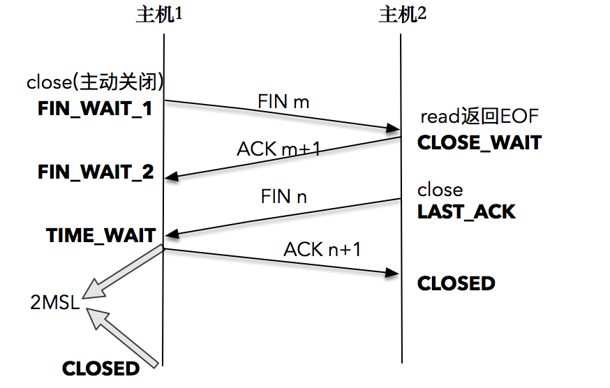

### 10. TIME_WAIT

TCP 四次挥手，在四次挥手的过程中，发起连接断开的一方会有一段时间处于 TIME_WAIT 的状态

##### 实例

**问题出现：**在一次升级线上应用服务之后，我们发现该服务的可用性变得时好时坏，一段时间可以对外提供服务，一段时间突然又不可以，大家都百思不得其解。运维同学登录到服务所在的主机上，使用 netstat 命令查看后才发现，主机上有成千上万处于 TIME_WAIT 状态的连接。

**原因：**TCP每个连接会占用一个本地端口，当在高并发的情况下，TIME_WAIT 状态的连接过多，多到把本机可用的端口耗尽，应用服务就不能正常工作了。过了一段时间之后，处于 TIME_WAIT 的连接被系统回收并关闭后，释放出本地端口可供使用，应用服务可以正常工作。这样周而复始，

分析：TCP四次挥手，在最后客户端向服务器端发送完ACK报文后就处于TIME_WAIT ，需要等2MSL(最长分节生命期 MSL（maximum segment lifetime）的两倍),**Linux 系统停留在 TIME_WAIT 的时间为固定的 60 秒。**,<u>而且只有主动发起的那一方才会有TIME_WAIT 状态</u>

##### TIME_WAIT 的作用

如果客户端最后发送的ACK报文丢失，那么服务器端就会重新发送FIN报文，这时如果客户端关闭，则服务器端无法正常关闭，所以就有了TIME_WAIT ，客户端最后等待一个往返的时间，可以确保服务器端没有重发报文，那么就可以正常关闭。

2MSL 的时间是**从主机 1 接收到 FIN 后发送 ACK 开始计时的**；如果在 TIME_WAIT 时间内，因为主机 1 的 ACK 没有传输到主机 2，主机 1 又接收到了主机 2 重发的 FIN 报文，那么 2MSL 时间将重新计时。

##### TIME_WAIT 的危害

第一是内存资源占用，，基本可以忽略。

第二是对端口资源的占用，一个 TCP 连接至少消耗一个本地端口。要知道，端口资源也是有限的，一般可以开启的端口为 32768～61000 ，也可以通过`net.ipv4.ip_local_port_range`指定，如果 TIME_WAIT 状态过多，会导致无法创建新连接。

##### 如何优化

1.   net.ipv4.tcp_max_tw_buckets：当系统中处于 TIME_WAIT 的连接一旦超过这个值时，系统就会将所有的 TIME_WAIT 连接状态重置，并且只打印出警告信息
2.   调低 TCP_TIMEWAIT_LEN，重新编译系统，
3.   net.ipv4.tcp_tw_reuse：复用处于 TIME_WAIT 的套接字为新的连接所用。

### 11.优雅地关闭还是粗暴地关闭

close方式关闭套接字：这个函数会对套接字引用计数减一，一旦发现套接字引用计数到 0，就会对套接字进行彻底释放，并且会关闭**TCP 两个方向的数据流**。

shutdown ：SHUT_RD(0)：关闭连接的“读”这个方向，SHUT_WR(1)：关闭连接的“写”这个方向，SHUT_RDWR(2)关闭套接字的读和写两个方向。

close 函数关闭连接的方法，使用 close 函数关闭连接有两个需要明确的地方。

*   close 函数只是把套接字引用计数减 1，未必会立即关闭连接；
*   close 函数如果在套接字引用计数达到 0 时，立即终止读和写两个方向的数据传送。
*   期望关闭连接其中一个方向时，应该使用 shutdown 函数

### 12.连接无效：使用Keep-Alive还是应用心跳来检测？

##### TCP Keep-Alive 选项

在没有数据读写的“静默”的连接上，是没有办法发现 TCP 连接是有效还是无效的。比如客户端突然崩溃，服务器端可能在几天内都维护着一个无用的 TCP 连接，实际上，TCP 有一个保持活跃的机制叫做 Keep-Alive：

这个机制的原理是这样的：定义一个时间段，在这个时间段内，如果没有任何连接相关的活动，TCP 保活机制会开始作用，<u>每隔一个时间间隔，发送一个探测报文，该探测报文包含的数据非常少</u>，如果连续几个探测报文都没有得到响应，则认为当前的 TCP 连接已经死亡，系统内核将错误信息通知给上层应用程序。

上述的可定义变量，分别被称为保活时间、保活时间间隔和保活探测次数。在 Linux 系统中，这些变量分别对应 sysctl 变量net.ipv4.tcp_keepalive_time、net.ipv4.tcp_keepalive_intvl、 net.ipv4.tcp_keepalve_probes，默认设置是 7200 秒（2 小时）、75 秒和 9 次探测。

##### 应用层探活

TCP 自身的 keep-Alive 机制，在 Linux 系统中，最少需要经过 2 小时 11 分 15 秒才可以发现一个“死亡”连接（ <u>2 小时，加上 75 秒乘以 9 的总和</u>）

对于对时延比较敏感的系统来说，这个时延是不能接受的，所以我们需要在应用程序这一层来寻找更好的解决方案：

我们可以设计一个PING-PONG 的机制，需要保活的一方，比如客户端，在保活时间达到后，发起对连接的 PING 操作，如果服务器端对 PING 操作有回应，则重新设置保活时间，否则对探测次数进行计数，如果最终探测次数达到了保活探测次数预先设置的值之后，则认为连接已经无效。

这里有两个比较关键的点：第一个是需要使用定时器，这可以通过**使用 I/O 复用自身的机制**来实现；第二个是需要设计一个 **PING-PONG 的协议**

1.   消息格式的设计

2.   客户端程序实现

     >   1.   创建了 TCP 套接字；创建了 IPv4 目标地址，其实就是服务器端地址；向服务器端发起连接
     >   2.   初始化 select 函数的套接
     >   3.   调用 select 函数，感知 I/O 事件；客户端已经在 KEEP_ALIVE_TIME 这段时间内没有收到任何对当前连接的反馈，于是发起 PING 消息，客户端在接收到服务器端程序之后对消息进行处理。

3.   服务器程序实现

     >   1.   创建一个本地 TCP 监听套接字，绑定该套接字到本地端口和 ANY 地址上，调用 listen 和 accept 完成被动套接字转换和监听
     >
     >   2.   从建立的连接套接字上读取数据，解析报文，根据消息类型进行不同的处理。并返回对应的响应。

##### UDP

UDP里面各方并不会维护一个socket上下文状态是无连接的，如果为了连接而保活是不必要的，如果为了**探测对端是否正常工作而做ping-pong**也是可行的。

##### HTTP header

HTTP Header也能设置Connection: Keep-Alive，也是应用层协议,HTTP的 keep-alive是为了使http变成长连接，在此前的http 1.0中，每次http的请求-响应之后，tcp连接就会被释放掉，这显然是非常浪费的，于是通过加入keep-alive，使得http连接不会被立即释放。

### 13 | 小数据包应对之策：理解TCP协议中的动态数据传输

使用 write 或者 send 进行数据流的发送。但是调用这些接口并不意味着数据被真正发送到网络上，数据只是从应用程序中被拷贝到了**系统内核的套接字缓冲区中**，等待协议栈的处理。至于这些数据是什么时候被发送出去的，对应用程序来说，是无法预知的。对这件事情真正负责的，是运行于**操作系统内核的 TCP 协议栈**实现模块。

这就涉及到了TCP实现中的拥塞控制（慢启动，拥塞避免，快重传，快恢复）（**TCP中的拥塞控制算法：BBR等）**

##### TCP是如何有效利用带宽的

1.   糊涂窗口综合症，接收端不能在接收缓冲区空出一个很小的部分之后，就急吼吼地向发送端发送窗口更新通知，而是需要在自己的缓冲区大到一个合理的值之后，再向发送端发送窗口更新通知。
2.   Nagle 算法，在任何一个时刻，未被确认的小数据包不能超过一个。这里的小数据包，指的是长度小于最大报文段长度 MSS 的 TCP 分组。这样，发送端就可以把接下来**连续的几个小数据包存储起来**，等待接收到前一个小数据包的 ACK 分组之后，再将数据一次性发送出去。
3.   延时 ACK。延时 ACK 在收到数据后并不马上回复，而是累计需要发送的 ACK 报文，等到有数据需要发送给对端时，将累计的 ACK捎带一并发送出去。当然，不能无限地延时下去，否则发送端误认为数据包没有发送成功，引起重传，反而会占用额外的网络带宽。

##### 禁用 Nagle 算法

