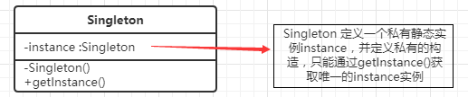
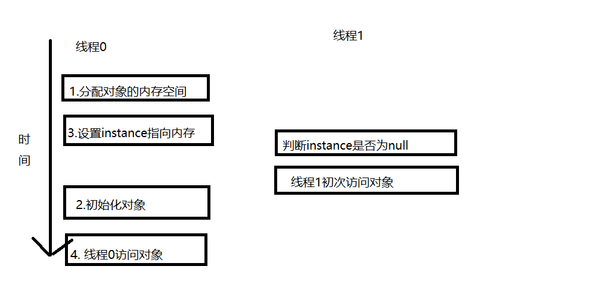

## 单例模式
### 定义
为了节约系统资源，有时需要确保系统中某个类只有**唯一一个实例**，当这个唯一实例创建成功之后，就**无法再创建一个同类型的其他对象**，所有的操作都只能基于这个**唯一实例**。为了确保对象的唯一性，可以通过**单例模式**来实现。是一种对象创建型模式
### 结构


### 代码示例

单例模式的写法有很多演变形式，下面我将从最简单的形式开始，然后逐渐演化

1. 饿汉式

   

1. 懒汉式

```
public class LazySingleton {
    private static LazySingleton lazySingleton = null;
    private LazySingleton(){
        if(lazySingleton != null){
            throw new RuntimeException("单例构造器禁止反射调用");
        }
    }
    public static LazySingleton getInstance(){
        if(lazySingleton == null){
            lazySingleton = new LazySingleton();
        }
        return lazySingleton;
    }
```
这种是线程不安全，当同时有多个线程时候，在前一个对象进入了if语句但还没创建对象时，可能发生时间片切换，这时另外一个线可能进过if判断 进入也会创建一个对象
```

public class LazySingleton {
    private static LazySingleton lazySingleton = null;
   
    public synchronized static LazySingleton getInstance(){
        if(lazySingleton == null){
            lazySingleton = new LazySingleton();
        }
        return lazySingleton;
    }
```
这种是线程安全的，通过synchronized对LazySingleton加锁，同一时间只有一个对象可以访问类，在退出的时候，去除锁.但是因为加锁需要耗费cpu资源，所以这种方式可能会造成效率不高

2. 双重检验


```
public class Singleton {
    private static volatile Singleton instance;
    private Singleton(){}
    public static Singleton getInstance(){
        if (instance == null){
            synchronized (Singleton.class){
                if (instance == null){
                    instance = new Singleton();
                }
            }
        }
        return instance;
    }
}
```
如果**不加 volatile**关键字会有隐患，原因如下：java在编译时虚拟机会对代码进行重排序， instance = new Singleton();语句会发生下面三个过程

```
1.分配内存给这个对象
2.初始化这个对象
3.设置instance对象，指向刚分配的内存；第2个过程和第3个可能会重排序调换位置
```


如上图所示，假设有一种情况线程0发生了重排序，执行到第三步之后，切换到线程1，执行两个步骤，但是线程1初次访问对象会抛出异常，因为对象虽然指向一块内存地址，但并没有执行第2步骤（初始化对象)，所以我们需要加上volatile来禁止在此处发生重排序  


在getInstance()方法中对instance进行了两次判空，第一次是为了不必要的同步，因为只有第一次调用getInstance()方法才需要同步，第二次是在singleton等于null的情况下才创建实例。

缺点是：代码相对其他较为复杂，有一定的性能损耗。
优点是：既可以达到线程安全，也可以使性能不受很大的影响，换句话说在保证线程安全的前提下，既节省空间也节省了时间。

3. 静态内部类
```
public class Singleton {
    private Singleton(){}
    public static Singleton getInstance(){
        return SingletonHolder.sInstance;
    }
    private static class SingletonHolder{
        private static final Singleton sInstance = new Singleton();
    }
}
```
缺点是：与编程语言本身的特性相关，很多面向对象语言不支持。
优点是：由于静态单例对象没有作为Singleton的成员变量直接实例化，因此类加载时不会实例化Singleton，第一次调用getInstance()时将加载内部类SingletonHolder，在该内部类中定义了一个static类型的变量sInstance，此时会首先初始化这个成员变量，由Java虚拟机来保证其线程安全性，确保该成员变量只能初始化一次。由于getInstance()方法没有任何线程锁定，因此其性能不会造成任何影响。

4. 饿汉式

```
public class HungrySingleton implements Serializable,Cloneable{

    private final static HungrySingleton hungrySingleton;

    static{
        hungrySingleton = new HungrySingleton();
    }
    public static HungrySingleton getInstance(){
        return hungrySingleton;
    }
}
```
这种方式**在类装载的时候就创建**，不管用不用，先创建了再说。
缺点：如果一直没有被使用，便浪费了空间，典型的空间换时间，如果初始化很耗费时间，同时也会推迟系统的启动时间。
优点是：简单，不需要使用线程同步或其他方式来完成。
5. 枚举(effective java 推荐)

```
public enum Singleton {
    INSTANCE;//定义一个枚举的元素，它就是 Singleton 的一个实例
    public void doSomething(){}
}
public static void main(String args[]) {
    Singleton singleton = Singleton.instance;
    singleton.doSomeThing();
}
```
==缺点==是：大部分应用开发很少用枚举，可读性并不是很高。  
==优点==是：使用枚举来实现单实例控制会更加简洁，而且无偿地提供了序列化机制，并由JVM从根本上提供保障，绝对防止多次实例化，而且能够很好地**预防反射攻击**。
6. 容器管理
```
public class ContainerSingleton {
    private ContainerSingleton(){
    }
    private static Map<String,Object> singletonMap = new HashMap<String,Object>();

    public static void putInstance(String key,Object instance){
        if(StringUtils.isNotBlank(key) && instance != null){
            if(!singletonMap.containsKey(key)){
                singletonMap.put(key,instance);
            }
        }
    }
    public static Object getInstance(String key){
        return singletonMap.get(key);
    }
}
```
这种是用SingletonManager 将多种单例类统一管理，在使用时根据key获取对象对应类型的对象。
缺点是：这也不是线程安全的，当然可以用**ConcurrentHashMap改进**。
优点是：这种方式使得我们可以管理多种类型的单例，并且在使用时可以通过统一的接口进行获取操作，降低了用户的使用成本，也对用户隐藏了具体实现，降低了耦合度。

### 优点缺点
==优点==：  
- 单例模式提供了对唯一实例的受控访问。因为单例类封装了它的唯一实例，所以它可以严格控制客户怎样以及何时访问它。
- 由于在系统内存中只存在一个对象，因此可以节约系统资源，对于一些需要频繁创建和销毁的对象单例模式无疑可以提高系统的性能。
- 允许可变数目的实例。基于单例模式我们可以进行扩展，使用与单例控制相似的方法来获得指定个数的对象实例，既节省系统资源，又解决了单例单例对象共享过多有损性能的问题。

==缺点==：  
- 由于单例模式中没有抽象层，因此单例类的扩展有很大的困难。
- 单例类的职责过重，在一定程度上违背了“单一职责原则”。因为单例类既充当了工厂角色，提供了工厂方法，同时又充当了产品角色，包含一些业务方法，将产品的创建和产品的本身的功能融合到一起。
- 滥用单例将带来一些负面问题，如为了节省资源将数据库连接池对象设计为单例类，可能会导致共享连接池对象的程序过多而出现连接池溢出。
- 现在很多面向对象语言(如Java、C#)的运行环境都提供了自动垃圾回收的技术，因此，如果实例化的共享对象长时间不被利用，系统会认为它是垃圾，会自动销毁并回收资源，下次利用时又将重新实例化，这将导致共享的单例对象状态的丢失。
### 实例应用场景

```
java.lang.Runtime#getRuntime()
java.awt.Toolkit#getDefaultToolkit()
java.awt.GraphicsEnvironment#getLocalGraphicsEnvironment()
java.awt.Desktop#getDesktop()
```
### 总结

```
* 单例模式确保某一个类只有一个实例，而且自行实例化并向整个系统提供这个实例，这个类称为单例类，它提供全局访问的方法。单例模式的要点有三个：一是某个类只能有一个实例；二是它必须自行创建这个实例；三是它必须自行向整个系统提供这个实例。单例模式是一种对象创建型模式。
* 单例模式只包含一个单例角色：在单例类的内部实现只生成一个实例，同时它提供一个静态的工厂方法，让客户可以使用它的唯一实例；为了防止在外部对其实例化，将其构造函数设计为私有。
* 单例模式的目的是保证一个类仅有一个实例，并提供一个访问它的全局访问点。单例类拥有一个私有构造函数，确保用户无法通过new关键字直接实例化它。除此之外，该模式中包含一个静态私有成员变量与静态公有的工厂方法。该工厂方法负责检验实例的存在性并实例化自己，然后存储在静态成员变量中，以确保只有一个实例被创建。
* 单例模式的主要优点在于提供了对唯一实例的受控访问并可以节约系统资源；其主要缺点在于因为缺少抽象层而难以扩展，且单例类职责过重。
* 单例模式适用情况包括：系统只需要一个实例对象；客户调用类的单个实例只允许使用一个公共访问点。
```