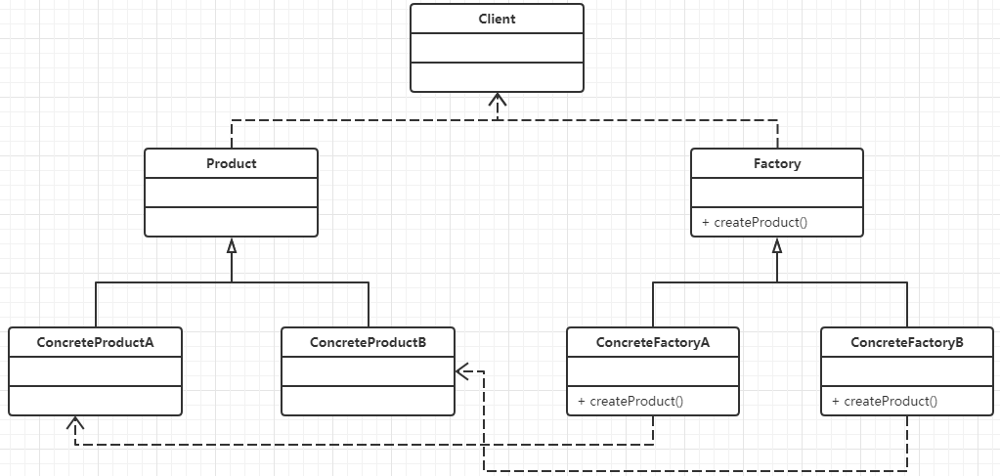

## 2.工厂模式
针对简单工厂模式的问题，我们改进了其代码，工厂模式也就应运而生，在工厂模式中，当我们扩展产品实例时候不需要修改以往的代码，而是可以新增加一些代码，来完成其扩展

### 定义
定义一个创建对象的接口，但让实现这个接口的类来决定实例化那个类，工厂方法让这个类实例化推迟到子类中进行，是一个创建型模式

### 结构图


主要有如下几个角色：

- Factory（抽象工厂类），声明了工厂方法(Factory Method)，用于返回一个产品。所有创建对象的工厂类都必须实现该接口。
- ConcreteFactory（具体工厂类）：它是抽象工厂类的子类，实现了抽象工厂中定义的工厂方法，并可由客户端调用，返回一个具体产品类的实例。
- Product（抽象产品类）：它是定义产品的接口，是工厂方法模式所创建对象的超类型，也就是产品对象的公共父类。
- （ConcreteProduct具体产品类）：它实现了抽象产品接口，某种类型的具体产品由专门的具体工厂创建，具体工厂和具体产品之间一一对应。
### 代码示例
1.抽象产品类
```
public abstract class Video {
    public abstract void produce();
}

```
2. 具体产品类
```
public class JavaVideo extends Video {
    @Override
    public void produce() {
        System.out.println("录制Java课程视频");
    }
}
public class PythonVideo extends Video {
    @Override
    public void produce() {
        System.out.println("录制Python课程视频");
    }
}
```
3. 抽象工厂

```
public abstract class VideoFactory {
    public abstract Video getVideo();
//主要区别就在这里，简单工厂模式在这里创建实例，工厂模式这里定义一个抽象类，具体实现到具体工厂类中
}
```
4.  具体工厂类(具体实例创建)

```
public class JavaVideoFactory extends VideoFactory {
    @Override
    public Video getVideo() {
        return new JavaVideo();
    }
}
public class PythonVideoFactory extends VideoFactory {
    @Override
    public Video getVideo() {
        return new PythonVideo();
    }
}
// 具体实例创建移动到这里了
```
最后理一遍过程，在简单工厂模式在抽象工厂创建实例，工厂模式定义一个抽象类，具体实现到通过具体工厂继承抽象工厂，在客户端就可以通过new具体的工厂类来实现实例创建

5. 客户端：

```
public class Test {
    public static void main(String[] args) {
        //创建具体的工厂
        JavaVideoFactory factoryA = new JavaVideoFactory();
        //生产相对应的产品
        factoryA.getProduct().intro();
        FactoryB PythonVideoFactory = new PythonVideoFactory();
        factoryB.getProduct().intro();
    }
}
```

### 使用场景
1. 创建对象需要大量重复的代码
2. 客户端不需要知道具体产品类的类名，只需要知道所对应的工厂即可，具体的产品对象由具体工厂类创建；客户端需要知道创建具体产品的工厂类。
3. 客户端在使用时可以无须关心是哪一个工厂子类创建产品子类，需要时再动态指定，可将具体工厂类的类名存储在配置文件或数据库中。

### 优缺点
==优点：==
- 工厂方法用来创建客户端所需要的产品，同时还向客户端隐藏了哪种具体产品类将被实例化这一细节，客户端只需要关心所需产品对应的工厂，无须关心创建细节，甚至无须知道具体产品类的类名。
- 在系统中加入新产品时，无须修改抽象工厂和抽象产品提供的接口，无须修改客户端，也无须修改其他的具体工厂和具体产品，而只要添加一个具体工厂和具体产品就可以了。这样，系统的可扩展性也就变得非常好，完全符合“开闭原则”。  

==缺点：==
- 类的个数容易过多，增加复杂度
- 增加了系统的抽象性和理解难度

### 实际应用
1. jdk中的collection集合中Iteratior接口和ArrayList等集合之间的关系（有时间在写写关于jdk源码的解析）

    

2. url和handler的关系

3. slf4j.Logger里面的loggerFactory
```
java.lang.Proxy#newProxyInstance()
java.lang.Object#toString()
java.lang.Class#newInstance()
java.lang.reflect.Array#newInstance()
java .lang.reflect.Constructor#newInstance()
java.lang.Boolean#valueOf(String)
java.lang.Class#forName()
```