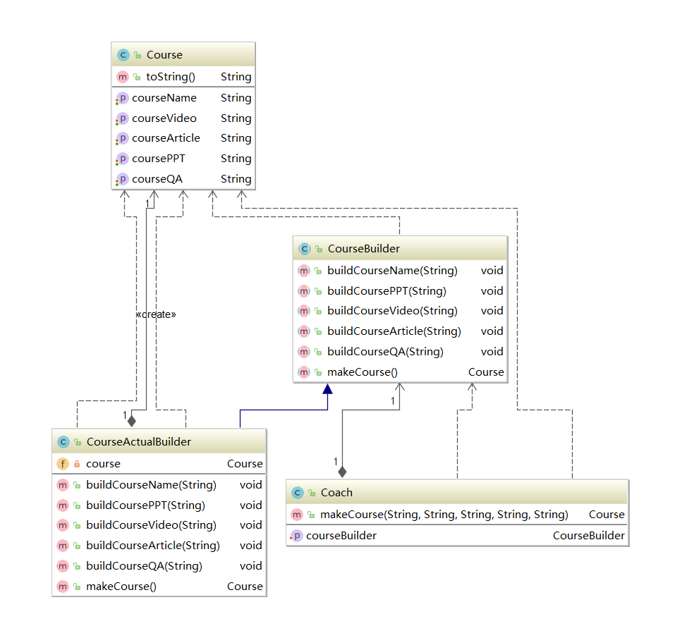

## 建造者模式（生成器模式）
### 定义：
生成器模式是指将一个复杂的对象的构建和它的表示相分离。使同样的构建过程可以创建不同的表示。适合该模式的情景如下：**对象结构复杂**，利用构造方法对创建对象无法满足用户需求。对象创建过程必须独立于创建该对象的类。
### 结构图

1. Builder（抽象建造者）：它为创建一个产品Product对象的各个部件指定抽象接口，在该接口中一般声明两类方法，一类方法是buildPartX()，它们用于创建复杂对象的各个部件；另一类方法是getResult()，它们用于返回复杂对象。Builder既可以是抽象类，也可以是接口。
2. ConcreteBuilder（具体建造者）：它实现了Builder接口，实现各个部件的具体构造和装配方法，定义并明确它所创建的复杂对象，也可以提供一个方法返回创建好的复杂产品对象。
3. Product（产品角色）：它是被构建的复杂对象，包含多个组成部件，具体建造者创建该产品的内部表示并定义它的装配过程。
4. Director（指挥者）：负责安排复杂对象的建造次序，指挥者与抽象建造者之间存在关联关系，可以在其construct()建造方法中调用建造者对象的部件构造与装配方法，完成复杂对象的建造。客户端一般只需要与指挥者进行交互，在客户端确定具体建造者的类型，并实例化具体建造者对象（也可以通过配置文件和反射机制），然后通过指挥者类的构造函数或者Setter方法将该对象传入指挥者类中。

### 代码实例
1. 抽象建造者
```
public abstract class CourseBuilder {
    public abstract void buildCourseName(String courseName);
    public abstract void buildCoursePPT(String coursePPT);
    public abstract void buildCourseVideo(String courseVideo);
    public abstract void buildCourseArticle(String courseArticle);
    public abstract void buildCourseQA(String courseQA);
    public abstract Course makeCourse();

}
```
2. 具体建造者（实现产品逻辑的创建）

```
public class CourseActualBuilder extends CourseBuilder {

    private Course course = new Course();
    @Override
    public void buildCourseName(String courseName) {
        course.setCourseName(courseName);
    }
    @Override
    public void buildCoursePPT(String coursePPT) {
        course.setCoursePPT(coursePPT);
    }
    @Override
    public void buildCourseVideo(String courseVideo) {
        course.setCourseVideo(courseVideo);
    }
    @Override
    public void buildCourseArticle(String courseArticle) {
        course.setCourseArticle(courseArticle);
    }
    @Override
    public void buildCourseQA(String courseQA) {
        course.setCourseQA(courseQA);
    }
    //所有的逻辑操作都已经完成，返回course（可以用来链式调用），比方说stringBuilder的append方法可以连续append
    @Override
    public Course makeCourse() {
        return course;
    }
}
```
3. 产品类
```
public class Course {
    private String courseName;
    private String coursePPT;
    private String courseVideo;
    private String courseArticle;
    private String courseQA;
    public String getCourseName() {
        return courseName;
    }
    public void setCourseName(String courseName) {
        this.courseName = courseName;
    }
    public String getCoursePPT() {
        return coursePPT;
    }
    public void setCoursePPT(String coursePPT) {
        this.coursePPT = coursePPT;
    }
    public String getCourseVideo() {
        return courseVideo;
    }
    public void setCourseVideo(String courseVideo) {
        this.courseVideo = courseVideo;
    }
    public String getCourseArticle() {
        return courseArticle;
    }
    public void setCourseArticle(String courseArticle) {
        this.courseArticle = courseArticle;
    }
    public String getCourseQA() {
        return courseQA;
    }
    public void setCourseQA(String courseQA) {
        this.courseQA = courseQA;
    }
    @Override
    public String toString() {
        return "Course{" +
                "courseName='" + courseName + '\'' +
                ", coursePPT='" + coursePPT + '\'' +
                ", courseVideo='" + courseVideo + '\'' +
                ", courseArticle='" + courseArticle + '\'' +
                ", courseQA='" + courseQA + '\'' +
                '}';
    }
}

```
4. 指挥官

```
// 主要用来完成逻辑的组装,也可以不用（在逻辑比较简单的时候）
public class Coach {
    private CourseBuilder courseBuilder;

    public void setCourseBuilder(CourseBuilder courseBuilder) {
        this.courseBuilder = courseBuilder;//需要将builder注入到coach类中使用
    }

    public Course makeCourse(String courseName,String coursePPT,
                             String courseVideo,String courseArticle,
                             String courseQA){
        this.courseBuilder.buildCourseName(courseName);
        this.courseBuilder.buildCoursePPT(coursePPT);
        this.courseBuilder.buildCourseVideo(courseVideo);
        this.courseBuilder.buildCourseArticle(courseArticle);
        this.courseBuilder.buildCourseQA(courseQA);
        return this.courseBuilder.makeCourse();
    }
}
```
### 建造者模式与抽象工厂模式
建造者模式完成的事，好像都可以通过抽象工厂模式完成，那么区别是什么？

- 与建造者模式相比，抽象工厂模式返回的是**一系列相关的产品**，这些产品位于++不同的产品等级结构，构成产品族++，而建造者模式返回的是一个组装好的完整产品。抽象工厂模式更像一个汽车零件生产商，生产不同品牌汽车的各种零件。而建造者模式更像一个汽车装配厂，++通过一系列零件的组装，最终生产出的是一个完整的汽车++。
- 抽象工厂模式中，客户端需实例化工厂类，然后通过工厂类获取所需的产品对象。而建造者模式更侧重于++将复杂的构造对象的方法交给建造者去做++，而客户端只需要++通过指挥者++就能创建一个完整的产品实例。

### 适用环境
在以下情况下可以考虑使用建造者模式：

- 需要生成的产品对象有复杂的内部结构，这些产品对象通常包含多个成员属性。
- 需要生成的产品对象的属性相互依赖，需要指定其生成顺序。
- 对象的创建过程独立于创建该对象的类。在建造者模式中通过引入了指挥者类，将创建过程封装在指挥者类中，而不在建造者类和客户类中。
- 隔离复杂对象的创建和使用，并使得相同的创建过程可以创建不同的产品。

### 优缺点
==优点==：  
1. 在建造者模式中，客户端不必知道产品内部组成的细节，将产品本身与产品的创建过程解耦，使得相同的创建过程可以创建不同的产品对象。
2. 每一个具体建造者都相对独立，而与其他的具体建造者无关，因此可以很方便地替换具体建造者或增加新的具体建造者，用户使用不同的具体建造者即可得到不同的产品对象。由于指挥者类针对抽象建造者编程，增加新的具体建造者无须修改原有类库的代码，系统扩展方便，符合“开闭原则”。
3. 可以更加精细地控制产品的创建过程。将复杂产品的创建步骤分解在不同的方法中，使得创建过程更加清晰，也更方便使用程序来控制创建过程。  

==缺点==：
1. 建造者模式所创建的产品一般具有较多的共同点，其组成部分相似，如果产品之间的差异性很大，例如很多组成部分都不相同，不适合使用建造者模式，因此其使用范围受到一定的限制。
2. 如果产品的内部变化复杂，可能会导致需要定义很多具体建造者类来实现这种变化，导致系统变得很庞大，增加系统的理解难度和运行成本。

### 实际场景应用

```
1. java.lang.StringBuilder#append()
2. java.lang.StringBuffer#append()
3. java.sql.PreparedStatement
4. javax.swing.GroupLayout.Group#addComponent()
```