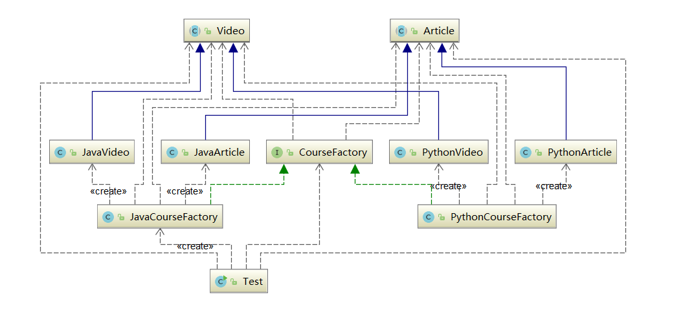

## 2.抽象工厂模式
### 定义：
提供一个创建一系列相关或者相互依赖对象的接口，无需指定其具体的类。**创建型模式**
### 结构图

1. Factory（抽象工厂）：它声明了一组用于创建一族产品的方法，每一个方法对应一种产品。
2. ConcreteFactory（具体工厂）：它实现了在抽象工厂中声明的创建产品的方法，生成一组具体产品，这些产品构成了一个产品族，每一个产品都位于某个产品等级结构中。
2. Product（抽象产品）：它为每种产品声明接口，在抽象产品中声明了产品所具有的业务方法。
3. ConcreteProduct（具体产品）：它定义具体工厂生产的具体产品对象，实现抽象产品接口中声明的业务方法。

### 代码实例
1. 声明抽象产品

```
public abstract class Video {
    public abstract void produce();

}
public abstract class Article {
    public abstract void produce();
}
```
2. 定义具体产品

```
public class JavaVideo extends Video {
    @Override
    public void produce() {
        System.out.println("录制Java课程视频");
    }
}
public class JavaArticle extends Article {
    @Override
    public void produce() {
        System.out.println("编写Java课程手记");
    }
}
public class PythonVideo extends Video {
    @Override
    public void produce() {
        System.out.println("录制Python课程视频");
    }
}
public class PythonArticle extends Article {
    @Override
    public void produce() {
        System.out.println("编写Python课程手记");
    }
}

```


3. 定义抽象工厂
```
public interface CourseFactory {
    Video getVideo();
    Article getArticle();
}
```
4. 定义具体工厂

```
public class JavaCourseFactory implements CourseFactory {
    @Override
    public Video getVideo() {
        return new JavaVideo();
    }

    @Override
    public Article getArticle() {
        return new JavaArticle();
    }
}

public class PythonCourseFactory implements CourseFactory {
    @Override
    public Video getVideo() {
        return new PythonVideo();
    }

    @Override
    public Article getArticle() {
        return new PythonArticle();
    }
}
```
抽象工厂的语义描述如下：设 A 产品有 A_1  、A_2  、…、A_n   ，B 产品有 B_1  、B_2  、…、B_n   ，共享特征 C，C 有 C_1  、C _2   、…、C_n   ，即 C  1  特征的产品是 A_1  、B_1  ，C_2  特征的产品是 A_2  、B_2  ，…，C_n   特征的产品是 A_n   、B_n和C_n

### 适用场景
当需要创建的对象是一系列相互关联或相互依赖的产品族时，便可以使用抽象工厂模式。说的更明白一点，就是一个继承体系中，如果存在着多个等级结构（即存在着多个抽象类），并且分属各个等级结构中的实现类之间存在着一定的关联或者约束，就可以使用抽象工厂模式。假如各个等级结构中的实现类之间不存在关联或约束，则使用多个独立的工厂来对产品进行创建，则更合适一点。
### 优缺点
==优点==：抽象工厂模式除了具有**工厂方法模式的优点**外，最主要的优点就是**可以在类的内部对产品族进行约束**。所谓的产品族，一般或多或少的都存在一定的关联，抽象工厂模式就可以在类内部对产品族的关联关系进行定义和描述，而不必专门引入一个新的类来进行管理。
==缺点==：产品族的扩展将是一件十分费力的事情，假如产品族中需要增加一个新的产品，则几乎所有的工厂类都需要进行修改。所以使用抽象工厂模式时，对产品等级结构的划分是非常重要的。

###在java源码中
```
java.util.Calendar#getInstance()
java.util.Arrays#asList()
java.util.ResourceBundle#getBundle()
java.sql.DriverManager#getConnection()
java.sql.Connection#createStatement()
java.sql.Statement#executeQuery()
java.text.NumberFormat#getInstance()
javax.xml.transform.TransformerFactory#newInstance()
```