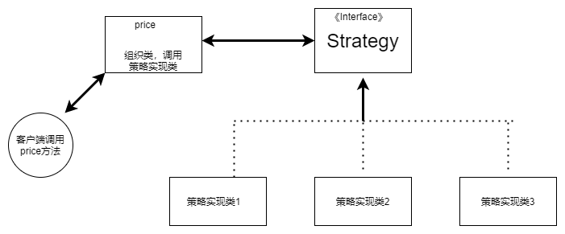

策略模式
--------

策略模式的重心不是如何实现算法，而是如何组织、调用这些算法，从而让程序结构更灵活，具有更好的维护性和扩展性。

策略模式属于**对象的行为模式**。其用意是**针对一组算法，将每一个算法封装到具有共同接口的独立的类中**，从而使得它们可以相互替换。策略模式使得算法可以在不影响到客户端的情况下发生变化。



这个模式涉及到三个角色：

　　●　　**环境(Context)角色：**//持有一个具体策略的对象，组织实现类的使用。

　　●　　**抽象策略(Strategy)角色：**这是一个抽象角色，通常由一个接口或抽象类实现。此角色给出所有的具体策略类所需的接口。

　　●　　**具体策略(ConcreteStrategy)角色：**包装了相关的算法或行为。


### 代码实例

```java
public interface Strategy {
    /**
     * 策略方法
     */
    public void strategyInterface();
}
public class ConcreteStrategyA implements Strategy {
    @Override
    public void strategyInterface() {
        //相关的业务
    }
}
public class ConcreteStrategyB implements Strategy {
    @Override
    public void strategyInterface() {
        //相关的业务
    }
}
public class ConcreteStrategyC implements Strategy {
    @Override
    public void strategyInterface() {
        //相关的业务
    }
}
public class Context {
    //持有一个具体策略的对象
    private Strategy strategy;
    /**
     * 构造函数，传入一个具体策略对象
     * @param strategy    具体策略对象
     */
    public Context(Strategy strategy){
        this.strategy = strategy;
    }
    /**
     * 策略方法
     */
    public void contextInterface(){ 
        strategy.strategyInterface();
    }
}
```


### 策略模式的优点

　　（1）策略模式提供了**管理相关的算法族的办法**。策略类的等级结构定义了一个算法或行为族。恰当**使用继承可以把公共的代码移到父类里面，从而避免代码重复**。

　　（2）使用策略模式可以避免使用**多重条件(if-else)语句**。多重条件语句不易维护，它把采取哪一种算法或采取哪一种行为的逻辑与算法或行为的逻辑混合在一起，统统列在一个多重条件语句里面，比使用继承的办法还要原始和落后。

### 策略模式的缺点

　　（1）客户端必须知道所有的策略类，并自行决定使用哪一个策略类。这就意味着客户端必须理解这些算法的区别，以便适时选择恰当的算法类。换言之，**策略模式只适用于客户端知道算法或行为的情况**。

　　（2）由于策略模式把每个具体的策略实现都单独封装成为类，如果备选的策略很多的话，那么对象的数目就会很可观。