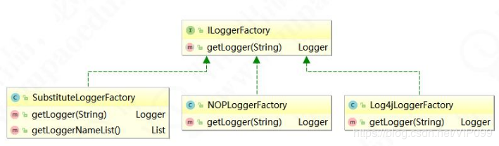

## 1.简单工厂模式
### 定义：
定义一个工厂类，他可以根据参数的不同返回不同类的实例，被创建的实例通常都具有共同的父类
### 结构：
1. Fatory(核心部分):负责实现创建所有产品的内部逻辑，工厂类可以被外界直接调用，创建所需对象;  
2. Product(抽象类产品)：工厂类所创建的所有对象的父类，封装了产品对象的公共方法，所有的具体产品为其子类对象  
3. ConcreteProduct(具体产品)：简单工厂模式的创建目标，所有被创建的对象都是某个具体类的实例。它要实现抽象产品中声明的抽象方法(有关抽象类)

### 代码实现

首先定义抽象产品类：定义一个接口，有一个抽象方法，子类实现接口，然后重写未实现的方法

```java
public abstract class Computer {
    /**
     * 产品的抽象方法，由具体的产品类去实现
     */
    public abstract void start();
}
```
然后定义具体产品类，分别定义各个电脑的具体实现

```
public class LenovoComputer extends Computer{
    @Override
    public void start() {
        System.out.println("联想电脑启动");
    }
public class HpComputer extends Computer{
    @Override
    public void start() {
        System.out.println("惠普电脑启动");
    }
}
public class AsusComputer extends Computer {
    @Override
    public void start() {
        System.out.println("华硕电脑启动");
    }
}
```
最后定义简单工厂模式的最核心部分：工厂实现类

```
public class ComputerFactory {
    public static Computer createComputer(String type){
        Computer mComputer=null;
        switch (type) {
            case "lenovo":
                mComputer=new LenovoComputer();
               break;
            case "hp":
                mComputer=new HpComputer();
                break;
            case "asus":
                mComputer=new AsusComputer();
                break;

        }
        return mComputer;
    }
}
```
剩下的就是客户端传入相应参数，获取对应产品的实例
```
public class CreatComputer {
    public static void main(String[]args){
      ComputerFactory.createComputer("hp").start();
    }
}
```
### 使用场景
- 工厂类负责创建的对象比较少
- 客户端只知道传入工厂类参数，而对于如何创建对象不关心

### 优缺点
==优点==：只需要传入一个正确的参数，就可以获取所需要的对象，不需知道创建细节  
==缺点==：违背开闭原则。因为新增产品类需要修改工厂类的判断逻辑

### 在jdk中的应用
1. JDK类库中广泛使用了简单工厂模式，如工具类java.text.DateFormat，它用于格式化一个本地日期或者时间以及Calendar日历类源码
2. logger源码，如下图
