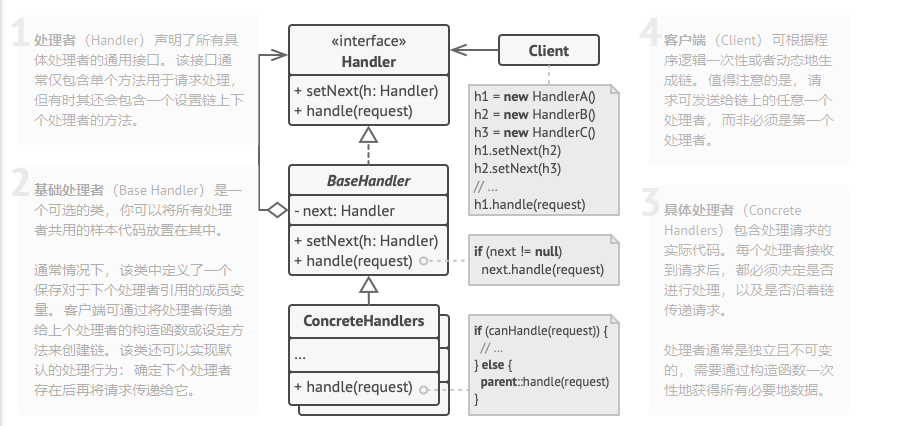

责任链模式
----------

### 简介

**责任链模式**是一种行为设计模式， 允许你将请求沿着处理者链进行发送。 收到请求后， 每个处理者均可对请求进行处理， 或将其传递给链上的下个处理者。

假如你正在开发一个在线订购系统。 你希望对系统访问进行限制， 只允许认证用户创建订单。 此外， 拥有管理权限的用户也拥有所有订单的完全访问权限。

简单规划后， 你会意识到这些检查必须依次进行。 只要接收到包含用户凭据的请求， 应用程序就可尝试对进入系统的用户进行认证。 但如果由于用户凭据不正确而导致认证失败， 那就没有必要进行后续检查了。认证可能扩展，也就是**增加了多步认证**，这时就可以使用上责任链模式，该模式建议你将这些处理者连成一条链。 链上的每个处理者都有一个成员变量来保存对于下一处理者的引用。 除了处理请求外， 处理者还负责沿着链传递请求。 请求会在链上移动， 直至所有处理者都有机会对其进行处理。

最重要的是： **处理者可以决定不再沿着链传递请求， 这可高效地取消所有后续处理步骤**。



### 代码

```java
public abstract class Handler {
    /**
     * 持有下一个处理请求的对象
     */
    protected Handler successor = null;
    /**
     * 取值方法
     */
    public Handler getSuccessor() {
        return successor;
    }
    /**
     * 设置下一个处理请求的对象
     */
    public void setSuccessor(Handler successor) {
        this.successor = successor;
    }
    /**
     * 处理聚餐费用的申请
     * @param user    申请人
     * @param fee    申请的钱数
     * @return        成功或失败的具体通知
     */
    public abstract String handleFeeRequest(String user , double fee);
}
public class ProjectManager extends Handler {

    @Override
    public String handleFeeRequest(String user, double fee) {
        
        String str = "";
        //项目经理权限比较小，只能在500以内
        if(fee < 500)
        {
            //为了测试，简单点，只同意张三的请求
            if("张三".equals(user))
            {
                str = "成功：项目经理同意【" + user + "】的聚餐费用，金额为" + fee + "元";    
            }else
            {
                //其他人一律不同意
                str = "失败：项目经理不同意【" + user + "】的聚餐费用，金额为" + fee + "元";
            }
        }else
        {
            //超过500，继续传递给级别更高的人处理
            if(getSuccessor() != null)
            {
                return getSuccessor().handleFeeRequest(user, fee);
            }
        }
        return str;
    }

}
public class DeptManager extends Handler {

    @Override
    public String handleFeeRequest(String user, double fee) {
        
        String str = "";
        //部门经理的权限只能在1000以内
        if(fee < 1000)
        {
            //为了测试，简单点，只同意张三的请求
            if("张三".equals(user))
            {
                str = "成功：部门经理同意【" + user + "】的聚餐费用，金额为" + fee + "元";    
            }else
            {
                //其他人一律不同意
                str = "失败：部门经理不同意【" + user + "】的聚餐费用，金额为" + fee + "元";
            }
        }else
        {
            //超过1000，继续传递给级别更高的人处理
            if(getSuccessor() != null)
            {
                return getSuccessor().handleFeeRequest(user, fee);
            }
        }
        return str;
    }

}
public class GeneralManager extends Handler {

    @Override
    public String handleFeeRequest(String user, double fee) {
        
        String str = "";
        //总经理的权限很大，只要请求到了这里，他都可以处理
        if(fee >= 1000)
        {
            //为了测试，简单点，只同意张三的请求
            if("张三".equals(user))
            {
                str = "成功：总经理同意【" + user + "】的聚餐费用，金额为" + fee + "元";    
            }else
            {
                //其他人一律不同意
                str = "失败：总经理不同意【" + user + "】的聚餐费用，金额为" + fee + "元";
            }
        }else
        {
            //如果还有后继的处理对象，继续传递
            if(getSuccessor() != null)
            {
                return getSuccessor().handleFeeRequest(user, fee);
            }
        }
        return str;
    }

}
public class Client {
    public static void main(String[] args) {
        //先要组装责任链
        Handler h1 = new GeneralManager();
        Handler h2 = new DeptManager();
        Handler h3 = new ProjectManager();
        h3.setSuccessor(h2);
        h2.setSuccessor(h1);
        
        //开始测试
        String test1 = h3.handleFeeRequest("张三", 300);
        System.out.println("test1 = " + test1);
        String test2 = h3.handleFeeRequest("李四", 300);
        System.out.println("test2 = " + test2);
        System.out.println("---------------------------------------");
        
        String test3 = h3.handleFeeRequest("张三", 700);
        System.out.println("test3 = " + test3);
        String test4 = h3.handleFeeRequest("李四", 700);
        System.out.println("test4 = " + test4);
        System.out.println("---------------------------------------");
        
        String test5 = h3.handleFeeRequest("张三", 1500);
        System.out.println("test5 = " + test5);
        String test6 = h3.handleFeeRequest("李四", 1500);
        System.out.println("test6 = " + test6);
    }

}
```

### 应用场景

JDK 中常见的 Filter 类，doFilter方法传入多个FilterChain来构建责任链