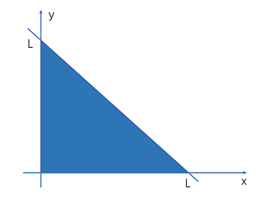
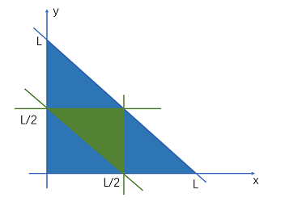

##### 1.两个人轮流扔硬币，谁先扔正面谁赢，求先抛的人赢得概率

> A先，B后
>
> P(A) = 1/2 +      //A直接取胜 
> 	   1/2 * 1/2 * 1/2 +      // A1失败B1失败A2取胜
> 	   1/2 * 1/2 * 1/2 * 1/2 *1/2  +    //A1失败B1失败A2失败B2失败A3取胜
> 	   ...
>
> p = 1/2 + (1/2)^3 + (1/2)^5 + (1/2)^7 + ...
> 等比数列求和
> p = 1/2 * (1 - (1/4)^n) / (1 - 1/4) = 2/3
>
> > 等比数列求和公式：(a1(1-q^n))/1-q||(a1-an*q)/1-q
>
> P(B） = 1/2 * 1/2 +     // A1失败B1取胜
>         1/2 * 1/2 * 1/2 * 1/2 +     // A1失败B1失败A2失败B2取胜
>         1/2 * 1/2 * 1/2 * 1/2 * 1/2 * 1/2 +  //A1失败B1失败A2失败B2失败A3失败B3取胜、
>         ...    
> p = (1/2)^2 + (1/2)^4 + (1/2)^6 + ..
>
> p = 1/4 * (1 - (1/4)^n) / (1 - 1/4)
> 		

##### 2.一共 1000 瓶药水，其中 1 瓶有毒药。已知小白鼠喝毒药一天内死若想在一天内找到毒药，最少需要几只小白鼠？

> 2^10=1024  10个二进制位可以表示1024种情况，则00000000001 是第一瓶毒药，以此类推，最后观察小白鼠死亡的组合，就可以看出是那个数字组合代表的瓶子有毒药

##### 3.切两刀构成三角形的概率

> 设3边长度分别为x,y,l-x-y,构成的区域为
>
> 
>
> 构成三角形的条件是**两边之和大于第三边**
>
> 因此以下不等式需成立：
>
> ① x + y > L – x – y 等价于 y > -x + L/2
>
> ② x + (L – x - y) > y 等价于 y < L/2
>
> ③ y + (L – x - y) > x 等价于 x < L/2
>
> 所以是1/4

##### 4.两个一样的绳子，粗细不均匀，每根燃烧需要1个小时，如何利用这两根绳子做个15分钟的计时？

> 假设一根绳子A，一根绳子B。
>
> 点燃A的一头，点燃B的两头，B烧完时（过了半个小时），A肯定只烧了一半，还剩半个小时
>
> 此时马上点燃A的另一头，从这个时间开始，到A烧完，就正好过了15分钟。

##### 5.32个球，重量都不一样，只有一个天平，需要多少次才能找到最重的？需要多少次才能找到第二重的？